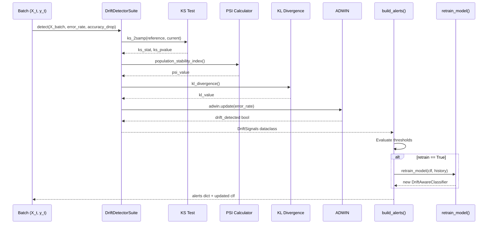
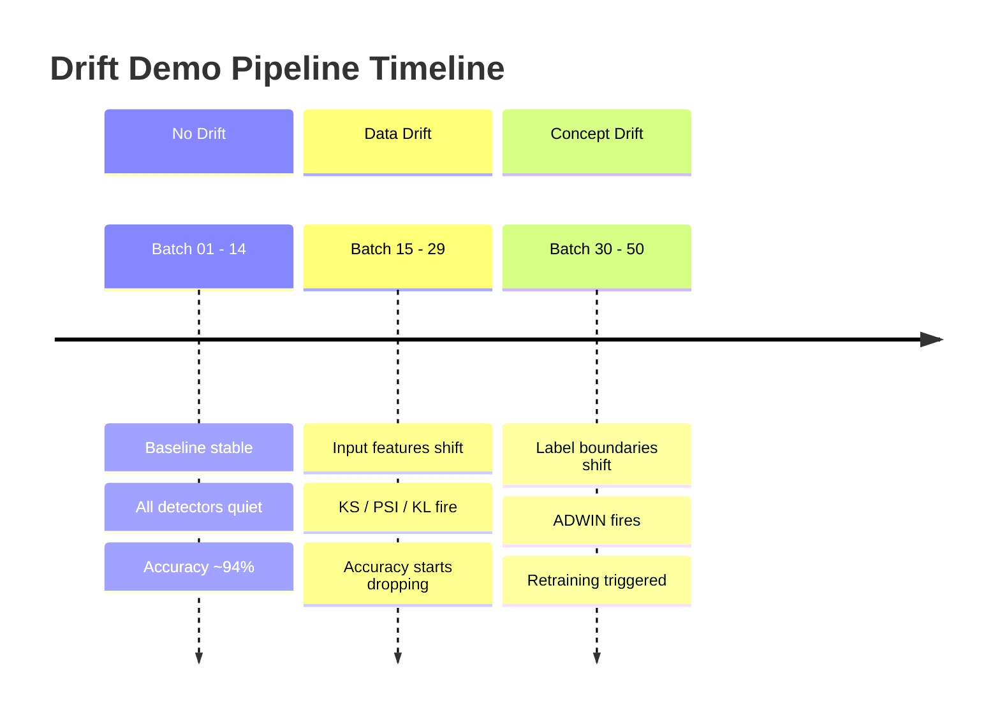
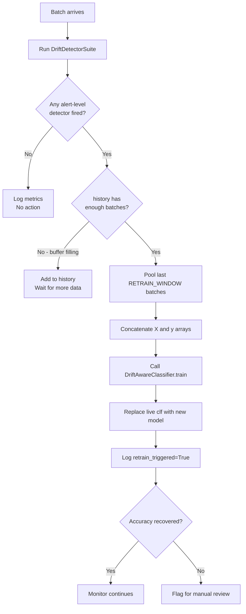

<div align="center">

# drift-demo

**A production-grade machine-learning drift detection and monitoring framework in Python.**

[](https://python.org)
[](https://scikit-learn.org)
[](https://dash.plotly.com)
[](https://pytorch.org)
[](https://riverml.xyz)
[](LICENSE)
[](https://github.com/psf/black)

</div>

---

## Overview

`drift-demo` is a fully self-contained Python framework that simulates, detects, and responds to machine-learning data drift in a streaming environment. In real-world deployments, models trained on historical data gradually degrade in performance as the real-world distribution of inputs and labels shifts over time - a phenomenon collectively called **drift**. This project provides a hands-on demonstration of the entire lifecycle: generating a synthetic data stream, intentionally injecting three distinct types of drift at configurable time steps, running a suite of four statistical detectors simultaneously, automatically triggering model retraining when alert thresholds are crossed, and producing both static plots and a live interactive dashboard for visualization.

The codebase is organized as a production-style pipeline with clearly separated concerns: data generation, drift injection, detection, model management, alerting, visualization, and configuration. Every module follows NASA-style structured comments so that each function's purpose, inputs, outputs, pre/postconditions, and failure modes are documented inline.

> [!IMPORTANT]
> This project is a **demonstration framework** designed for learning and experimentation. All data is synthetically generated. To adapt it for production, replace `src/data/generate_stream.py` with your real data ingestion layer and update thresholds in `src/utils/config.py` to match your domain.

---

## Table of Contents

- [Architecture](#architecture)
- [Tech Stack](#tech-stack)
- [Drift Types Explained](#drift-types-explained)
- [Detection Algorithms](#detection-algorithms)
- [Project Structure](#project-structure)
- [Configuration Reference](#configuration-reference)
- [Setup](#setup)
- [Running the Pipeline](#running-the-pipeline)
- [Outputs](#outputs)
- [Dashboard](#dashboard)
- [Notebook](#notebook)
- [API Reference](#api-reference)
- [Alert Thresholds](#alert-thresholds)
- [Pipeline Timing](#pipeline-timing)
- [Contributing](#contributing)

---

## Architecture

The system is built around a **streaming batch pipeline** where data arrives in fixed-size windows. Each window passes through the detector suite, which runs four independent statistical tests in parallel and aggregates their results into a single alert decision. When an alert fires the retraining module immediately rebuilds the classifier on a sliding window of recent batches and replaces the live model in place - no restart required.


> [!NOTE]
> The detector suite and the classifier both receive every batch independently. Detectors measure the **input distribution** while the classifier measures **predictive performance**. Together they cover all three drift dimensions.

---

## Tech Stack

The following table describes every major dependency, what role it plays in this project, and why it was chosen over alternatives.

| # | <sub>Package</sub> | <sub>Version</sub> | <sub>Role in Project</sub> | <sub>Why This Library</sub> |
|---|---|---|---|---|
| <sub>1</sub> | <sub>**numpy**</sub> | <sub>`>=1.24`</sub> | <sub>Array math for feature vectors, histogram binning, and metric calculations</sub> | <sub>Universal scientific computing foundation; zero-overhead array operations</sub> |
| <sub>2</sub> | <sub>**pandas**</sub> | <sub>`>=2.0`</sub> | <sub>Batch DataFrames, CSV log I/O, and drift log aggregation</sub> | <sub>Best-in-class tabular data manipulation with native CSV support</sub> |
| <sub>3</sub> | <sub>**scikit-learn**</sub> | <sub>`>=1.3`</sub> | <sub>RandomForest classifier, train/test splits, accuracy scoring</sub> | <sub>Stable, well-documented ML primitives; joblib serialization built-in</sub> |
| <sub>4</sub> | <sub>**scipy**</sub> | <sub>`>=1.11`</sub> | <sub>`ks_2samp` two-sample KS test for data drift detection</sub> | <sub>Gold-standard statistical testing library; KS test is exact and parameter-free</sub> |
| <sub>5</sub> | <sub>**river**</sub> | <sub>`>=0.18`</sub> | <sub>ADWIN adaptive windowing for online concept drift detection</sub> | <sub>Only production-quality online ML library with ADWIN; incremental by design</sub> |
| <sub>6</sub> | <sub>**torch**</sub> | <sub>`>=2.0`</sub> | <sub>Optional deep feature extraction and custom model backends</sub> | <sub>Flexible neural framework; GPU-ready if hardware is available</sub> |
| <sub>7</sub> | <sub>**plotly / dash**</sub> | <sub>`>=5.15 / 2.11`</sub> | <sub>Interactive live dashboard and zoomable time-series charts</sub> | <sub>Browser-based rendering; no GUI toolkit required; reactive callbacks</sub> |
| <sub>8</sub> | <sub>**matplotlib / seaborn**</sub> | <sub>`>=3.7 / 0.12`</sub> | <sub>Static publication-quality distribution and accuracy plots saved as PNG</sub> | <sub>Deterministic output files that can be committed to version control</sub> |
| <sub>9</sub> | <sub>**joblib**</sub> | <sub>`>=1.3`</sub> | <sub>Serializing and loading the trained model to `outputs/model.joblib`</sub> | <sub>Optimized for numpy arrays; faster and more memory-efficient than pickle for sklearn</sub> |
| <sub>10</sub> | <sub>**pyyaml**</sub> | <sub>`>=6.0`</sub> | <sub>Future config file support for YAML-based pipeline settings</sub> | <sub>Human-readable config format that is trivially diff-able in git</sub> |
| <sub>11</sub> | <sub>**tqdm**</sub> | <sub>`>=4.65`</sub> | <sub>Progress bars during batch streaming so runtime status is always visible</sub> | <sub>Zero-dependency progress display that works in terminals and notebooks</sub> |

---

## Drift Types Explained

Understanding the three distinct types of drift is essential for building robust monitoring. Each type has a different root cause and requires a different detection strategy.

```mermaid
graph LR
    subgraph "Drift Taxonomy"
        A[Incoming Data Stream] --> B((Batch t))
        B --> C{Drift Type?}
        C -->|Input X shifts| D[Data Drift\nCovariate Shift\nP(X) changes]
        C -->|Label boundary shifts| E[Concept Drift\nP(Y|X) changes]
        C -->|Accuracy degrades| F[Model Drift\nPerformance drop]
        D --> G[KS / PSI / KL\nDetectors]
        E --> H[ADWIN\nDetector]
        F --> I[Accuracy\nMonitor]
    end
```

| # | <sub>Drift Type</sub> | <sub>Technical Name</sub> | <sub>What Changes</sub> | <sub>When It Starts</sub> | <sub>Detector Used</sub> | <sub>Real-World Example</sub> |
|---|---|---|---|---|---|---|
| <sub>1</sub> | <sub>**Data Drift**</sub> | <sub>Covariate Shift</sub> | <sub>Distribution of input features P(X)</sub> | <sub>Batch 15</sub> | <sub>KS, PSI, KL</sub> | <sub>Sensor calibration change; seasonality in user behavior</sub> |
| <sub>2</sub> | <sub>**Concept Drift**</sub> | <sub>Posterior Shift</sub> | <sub>Relationship between X and Y: P(Y|X)</sub> | <sub>Batch 30</sub> | <sub>ADWIN on error rate</sub> | <sub>Fraud pattern evolves; medical definition updated</sub> |
| <sub>3</sub> | <sub>**Model Drift**</sub> | <sub>Performance Degradation</sub> | <sub>Model accuracy relative to baseline</sub> | <sub>Follows data/concept drift</sub> | <sub>Accuracy drop monitor</sub> | <sub>Any of the above causes model to make more mistakes</sub> |

> [!TIP]
> In practice, **data drift does not always cause model drift** immediately - a model may be robust to small distribution shifts. Monitoring all three types independently gives you early warning before accuracy actually falls.

---

## Detection Algorithms

The detector suite runs all four algorithms on every batch and aggregates their signals through `build_alerts`. This redundancy means that no single algorithm being overly sensitive or insensitive can dominate the alert decision.



| # | <sub>Algorithm</sub> | <sub>Type</sub> | <sub>Measures</sub> | <sub>Alert Threshold</sub> | <sub>Strengths</sub> | <sub>Limitations</sub> |
|---|---|---|---|---|---|---|
| <sub>1</sub> | <sub>**KS Test**</sub> | <sub>Non-parametric statistical test</sub> | <sub>Max difference between two CDFs</sub> | <sub>p-value < 0.05</sub> | <sub>No distribution assumptions; exact p-value</sub> | <sub>Sensitive to sample size; univariate only</sub> |
| <sub>2</sub> | <sub>**PSI**</sub> | <sub>Binned divergence metric</sub> | <sub>Shift in population proportions across bins</sub> | <sub>PSI >= 0.25</sub> | <sub>Industry standard in credit scoring; interpretable bins</sub> | <sub>Requires good binning strategy; univariate</sub> |
| <sub>3</sub> | <sub>**KL Divergence**</sub> | <sub>Information-theoretic measure</sub> | <sub>Information lost when using P to approximate Q</sub> | <sub>KL >= 0.30</sub> | <sub>Sensitive to tail shifts; asymmetric (directional)</sub> | <sub>Undefined if distributions have non-overlapping support</sub> |
| <sub>4</sub> | <sub>**ADWIN**</sub> | <sub>Online adaptive windowing</sub> | <sub>Change in mean error rate over adaptive windows</sub> | <sub>drift_detected == True</sub> | <sub>No fixed window size; statistically grounded; real-time</sub> | <sub>Requires streaming error rate; concept drift only</sub> |

> [!WARNING]
> KL Divergence can produce `inf` values when the current batch has bins with zero counts that the reference distribution has non-zero counts for. The implementation in `metrics.py` applies a small epsilon smoothing (`1e-10`) to prevent this. Always verify smoothing is appropriate for your domain.

---

## Project Structure

The repository separates every concern into its own module. Nothing is monolithic - each file has exactly one job, making it straightforward to swap out components (e.g., replace the RandomForest with a neural network by editing only `classifier.py`).

```text
drift-demo/
├── README.md                        - This file
├── requirements.txt                 - Pinned Python dependencies
├── notebooks/
│   └── drift_exploration.ipynb      - Interactive exploration and visualization
├── outputs/                         - Generated at runtime (gitignored)
│   ├── drift_log.csv                - Per-batch metrics time series
│   ├── model.joblib                 - Serialized trained classifier
│   └── plots/
│       ├── distribution_shift.png
│       ├── drift_signals.png
│       ├── accuracy_curve.png
│       └── before_after_retrain.png
└── src/
    ├── main.py                      - Pipeline entry point
    ├── data/
    │   ├── generate_stream.py       - Synthetic data and stream generator
    │   └── drift_injector.py        - Drift injection scheduler
    ├── drift/
    │   ├── detectors.py             - KS / PSI / KL / ADWIN suite
    │   ├── metrics.py               - PSI and KL math implementations
    │   └── alerts.py                - Alert aggregation and retrain trigger
    ├── model/
    │   ├── classifier.py            - RandomForest wrapper with drift awareness
    │   └── retrain.py               - Sliding-window retraining logic
    ├── visualize/
    │   ├── drift_plots.py           - Static matplotlib/seaborn plot generators
    │   └── dashboard.py             - Plotly Dash live dashboard
    └── utils/
        ├── config.py                - All thresholds and path constants
        └── logger.py                - CSV batch logging utility
```

---

## Configuration Reference

All tunable parameters live in `src/utils/config.py`. No magic numbers are scattered in business logic - every threshold is named, documented, and centralized so you can adjust behavior without touching the detection or model code.

| # | <sub>Parameter</sub> | <sub>Default</sub> | <sub>Type</sub> | <sub>Description</sub> | <sub>Effect of Increasing</sub> |
|---|---|---|---|---|---|
| <sub>1</sub> | <sub>`N_INITIAL_SAMPLES`</sub> | <sub>2000</sub> | <sub>int</sub> | <sub>Training set size for the baseline model</sub> | <sub>Stronger baseline; slower initial training</sub> |
| <sub>2</sub> | <sub>`N_STREAM_BATCHES`</sub> | <sub>50</sub> | <sub>int</sub> | <sub>Total number of time-step batches to simulate</sub> | <sub>Longer simulation; more drift phases visible</sub> |
| <sub>3</sub> | <sub>`BATCH_SIZE`</sub> | <sub>200</sub> | <sub>int</sub> | <sub>Samples per streaming batch</sub> | <sub>More stable statistics; less responsive</sub> |
| <sub>4</sub> | <sub>`DATA_DRIFT_START_BATCH`</sub> | <sub>15</sub> | <sub>int</sub> | <sub>Batch index where data drift injection begins</sub> | <sub>Delays when data drift appears</sub> |
| <sub>5</sub> | <sub>`CONCEPT_DRIFT_START_BATCH`</sub> | <sub>30</sub> | <sub>int</sub> | <sub>Batch index where concept drift injection begins</sub> | <sub>Delays concept drift phase</sub> |
| <sub>6</sub> | <sub>`DRIFT_RAMP_BATCHES`</sub> | <sub>5</sub> | <sub>int</sub> | <sub>Number of batches over which drift intensity ramps up gradually</sub> | <sub>Smoother, harder to detect early drift</sub> |
| <sub>7</sub> | <sub>`KS_P_VALUE_THRESHOLD`</sub> | <sub>0.05</sub> | <sub>float</sub> | <sub>p-value cutoff below which KS test fires</sub> | <sub>Fewer false positives; slower detection</sub> |
| <sub>8</sub> | <sub>`PSI_ALERT_THRESHOLD`</sub> | <sub>0.25</sub> | <sub>float</sub> | <sub>PSI score above which data drift is confirmed</sub> | <sub>Only catches severe distribution shifts</sub> |
| <sub>9</sub> | <sub>`KL_ALERT_THRESHOLD`</sub> | <sub>0.30</sub> | <sub>float</sub> | <sub>KL divergence above which drift is flagged</sub> | <sub>Tolerates more information loss before alerting</sub> |
| <sub>10</sub> | <sub>`ADWIN_DELTA`</sub> | <sub>0.002</sub> | <sub>float</sub> | <sub>ADWIN false-positive rate parameter</sub> | <sub>Less sensitive; fewer concept drift alerts</sub> |
| <sub>11</sub> | <sub>`RETRAIN_WINDOW`</sub> | <sub>5</sub> | <sub>int</sub> | <sub>Number of recent batches pooled for retraining</sub> | <sub>More training data; slower adaptation</sub> |
| <sub>12</sub> | <sub>`MIN_RETRAIN_ACCURACY_DROP`</sub> | <sub>0.05</sub> | <sub>float</sub> | <sub>Minimum accuracy drop to trigger retraining</sub> | <sub>Only retrains on severe degradation</sub> |

---

## Setup

These steps create an isolated Python virtual environment and install all dependencies. Using a virtual environment is strongly recommended - it prevents package conflicts with other Python projects on your machine.

```bash
# Clone the repository
git clone https://github.com/your-org/drift-demo.git
cd drift-demo

# Create and activate a virtual environment
python -m venv .venv
source .venv/bin/activate       # Linux / macOS
# .venv\Scripts\activate        # Windows

# Install all dependencies
pip install -r requirements.txt
```

> [!TIP]
> If you have a CUDA-capable GPU, replace the `torch` line in `requirements.txt` with the appropriate CUDA wheel from [pytorch.org](https://pytorch.org/get-started/locally/) before running `pip install`. The rest of the pipeline will continue to use CPU-based scikit-learn regardless.

---

## Running the Pipeline

The pipeline is a single command. It trains the baseline model, streams all 50 batches with drift injection, runs detectors on every batch, triggers retraining when thresholds are crossed, and writes all outputs to `outputs/`.

```bash
cd src
python main.py
```

Expected console output per batch looks like:

```
Batch 01 | acc=0.941 | KS p=0.812 | PSI=0.012 | KL=0.008 | ADWIN=False | retrain=False
Batch 16 | acc=0.903 | KS p=0.031 | PSI=0.143 | KL=0.112 | ADWIN=False | retrain=False
Batch 31 | acc=0.821 | KS p=0.001 | PSI=0.287 | KL=0.341 | ADWIN=True  | retrain=True
```



---

## Outputs

After a full pipeline run, four output artifacts are produced. These files are overwritten on each run so you always have the results of the most recent execution.

| # | <sub>File</sub> | <sub>Format</sub> | <sub>Contents</sub> | <sub>How to Use</sub> |
|---|---|---|---|---|
| <sub>1</sub> | <sub>`outputs/drift_log.csv`</sub> | <sub>CSV</sub> | <sub>Per-batch: accuracy, KS stat, KS p-value, PSI, KL, ADWIN flag, retrain flag, drift metadata</sub> | <sub>Load with `pd.read_csv()` for custom analysis; used as dashboard data source</sub> |
| <sub>2</sub> | <sub>`outputs/model.joblib`</sub> | <sub>joblib binary</sub> | <sub>The most recently trained `DriftAwareClassifier` instance</sub> | <sub>Load with `joblib.load()` for inference or inspection</sub> |
| <sub>3</sub> | <sub>`outputs/plots/distribution_shift.png`</sub> | <sub>PNG</sub> | <sub>Before/after feature histograms showing covariate shift</sub> | <sub>Include in reports; compare feature distributions visually</sub> |
| <sub>4</sub> | <sub>`outputs/plots/drift_signals.png`</sub> | <sub>PNG</sub> | <sub>Time-series of KS, PSI, KL, and ADWIN scores across all batches</sub> | <sub>Visualize when each detector fired and how scores evolved</sub> |
| <sub>5</sub> | <sub>`outputs/plots/accuracy_curve.png`</sub> | <sub>PNG</sub> | <sub>Model accuracy over time with retrain events annotated</sub> | <sub>Validate that retraining actually recovered performance</sub> |
| <sub>6</sub> | <sub>`outputs/plots/before_after_retrain.png`</sub> | <sub>PNG</sub> | <sub>Side-by-side accuracy before and after retraining episodes</sub> | <sub>Measure retraining effectiveness quantitatively</sub> |

---

## Alert Thresholds

The `build_alerts` function in `alerts.py` evaluates the `DriftSignals` dataclass against these thresholds to decide whether to trigger retraining. Multiple detectors must agree (OR logic with prioritized rules) before a retrain fires - this prevents a single hypersensitive detector from causing constant retraining.

| # | <sub>Condition</sub> | <sub>Threshold</sub> | <sub>Detector</sub> | <sub>Alert Level</sub> | <sub>Retrain Triggered</sub> |
|---|---|---|---|---|---|
| <sub>1</sub> | <sub>KS p-value below cutoff</sub> | <sub>p < 0.05</sub> | <sub>KS Test</sub> | <sub>Warning</sub> | <sub>Only if combined with PSI or KL</sub> |
| <sub>2</sub> | <sub>PSI in warning zone</sub> | <sub>0.10 <= PSI < 0.25</sub> | <sub>PSI</sub> | <sub>Warning</sub> | <sub>No - monitoring only</sub> |
| <sub>3</sub> | <sub>PSI in alert zone</sub> | <sub>PSI >= 0.25</sub> | <sub>PSI</sub> | <sub>Alert</sub> | <sub>Yes</sub> |
| <sub>4</sub> | <sub>KL divergence high</sub> | <sub>KL >= 0.30</sub> | <sub>KL Divergence</sub> | <sub>Alert</sub> | <sub>Yes</sub> |
| <sub>5</sub> | <sub>ADWIN change detected</sub> | <sub>drift_detected == True</sub> | <sub>ADWIN</sub> | <sub>Alert</sub> | <sub>Yes</sub> |
| <sub>6</sub> | <sub>Accuracy drop significant</sub> | <sub>drop >= 0.05</sub> | <sub>Accuracy Monitor</sub> | <sub>Alert</sub> | <sub>Yes</sub> |

> [!CAUTION]
> Setting `ADWIN_DELTA` too low (e.g., `0.0001`) will make ADWIN extremely sensitive and may trigger retraining on every single batch, causing the pipeline to spend more time retraining than making predictions. Start with the default `0.002` and tune based on your acceptable false-positive rate.

---

## Dashboard

The Plotly Dash interactive dashboard reads `outputs/drift_log.csv` and renders live-updating charts. It provides the same information as the static plots but with zoom, hover tooltips, and time-range selection.

```bash
cd src
python -m visualize.dashboard
```

Then open your browser to: **http://127.0.0.1:8050**

The dashboard displays:
- Accuracy over time with retrain event markers
- KS statistic and p-value time series
- PSI and KL divergence trends
- ADWIN state transitions (calm vs. drift detected)
- Per-batch metadata on hover

> [!NOTE]
> The dashboard reads the CSV log file on startup. If you re-run `main.py` while the dashboard is open, refresh the browser page to load the new results. For true live streaming visualization, the `dashboard.py` callback interval can be reduced.

---

## Notebook

The Jupyter notebook provides an exploratory environment for understanding each component in isolation before running the full pipeline. It is ideal for experimenting with different threshold values, visualizing individual detector behavior, and understanding the mathematics behind PSI and KL divergence.

```bash
jupyter notebook notebooks/drift_exploration.ipynb
```

The notebook covers:
- Synthetic data generation and stream construction
- Manual drift injection at arbitrary batch indices
- Individual detector outputs and threshold sensitivity analysis
- Side-by-side distribution comparisons
- Accuracy degradation curves with and without retraining

---

## API Reference

<details>
<summary><strong>Click to expand full API Reference</strong></summary>

### `src/data/generate_stream.py`

#### `get_initial_data() -> Tuple[np.ndarray, np.ndarray]`
Generates the baseline training dataset using `sklearn.datasets.make_classification` with `N_INITIAL_SAMPLES` samples and `N_FEATURES` features. Returns `(X_train, y_train)` numpy arrays. This is the reference distribution that all drift detectors compare against.

#### `stream_batches() -> Iterator[Tuple[int, np.ndarray, np.ndarray]]`
Yields `(batch_idx, X_batch, y_batch)` tuples for `N_STREAM_BATCHES` iterations. Each batch contains `BATCH_SIZE` samples drawn from the same underlying distribution as the training data before drift injection modifies them.

---

### `src/data/drift_injector.py`

#### `inject_all_drift(batch_idx, X_batch, y_batch) -> Tuple[np.ndarray, np.ndarray, dict]`
Applies data drift and concept drift to the incoming batch according to the configured schedule. Data drift is applied starting at `DATA_DRIFT_START_BATCH` by shifting the mean of feature columns. Concept drift is applied starting at `CONCEPT_DRIFT_START_BATCH` by flipping a fraction of labels. Returns the modified arrays and a metadata dict containing the current `data_drift_alpha` and `concept_drift_alpha` intensity values.

---

### `src/drift/detectors.py`

#### `class DriftDetectorSuite`
Maintains a stateful ADWIN instance and the reference feature distribution. Constructed once with the training data and then called on every incoming batch.

**`__init__(self, reference_X: np.ndarray) -> None`**
Extracts the first feature column from `reference_X` as the reference distribution and initializes ADWIN with `ADWIN_DELTA`.

**`detect(self, X_batch, error_rate, accuracy_drop) -> DriftSignals`**
Runs KS test, PSI, KL divergence, and ADWIN update on the current batch. Returns a `DriftSignals` dataclass with all raw scores and boolean drift flags.

#### `signals_to_dict(signals: DriftSignals) -> dict`
Converts a `DriftSignals` dataclass to a flat dictionary suitable for CSV logging.

---

### `src/drift/metrics.py`

#### `population_stability_index(reference, current, bins=10) -> float`
Computes PSI between two 1D arrays by binning both on the reference distribution edges and comparing proportions. PSI < 0.10 indicates no significant drift; 0.10-0.25 is moderate; > 0.25 is severe. Returns 0.0 if all bins match.

#### `kl_divergence(reference, current, bins=10) -> float`
Computes the KL divergence `D_KL(current || reference)` using histogram approximations with epsilon smoothing to handle zero-count bins. Returns a non-negative float where 0.0 means identical distributions.

---

### `src/drift/alerts.py`

#### `build_alerts(signals: DriftSignals, accuracy_drop: float) -> dict`
Evaluates all detector signals against configured thresholds and constructs an alert dictionary with keys `retrain` (bool), `reason` (str), and `level` (str). The function uses OR logic - any single alert-level signal is sufficient to trigger retraining.

---

### `src/model/classifier.py`

#### `class DriftAwareClassifier`
Thin wrapper around `sklearn.ensemble.RandomForestClassifier` that tracks baseline accuracy and exposes drift-aware evaluation methods.

**`train(self, X, y) -> DriftAwareClassifier`**
Fits the classifier, records the baseline accuracy on training data, and returns `self` for chaining.

**`evaluate(self, X, y) -> Tuple[float, float]`**
Returns `(current_accuracy, accuracy_drop)` where `accuracy_drop = baseline_accuracy - current_accuracy`. A positive drop indicates degradation.

---

### `src/model/retrain.py`

#### `retrain_model(clf, history, window) -> DriftAwareClassifier`
Pools the most recent `window` batches from `history`, concatenates them into a single training set, and calls `clf.train()` on the new data. Returns the updated classifier. The existing model weights are discarded and replaced entirely.

---

### `src/utils/config.py`
Module-level constants only - no functions. Import individual names or the module. All paths are absolute and computed relative to the repository root using `os.path.abspath(__file__)`.

---

### `src/utils/logger.py`

#### `log_batch(batch_idx: int, metrics: dict, notes: str) -> None`
Appends one row to `outputs/drift_log.csv`. Creates the file with headers on the first call; subsequent calls append without re-writing headers. Thread-unsafe by design - intended for single-process sequential pipelines only.

</details>

---

## Retraining Decision Flow



> [!IMPORTANT]
> Retraining uses only the most recent `RETRAIN_WINDOW` batches by default, which means the model adapts to the **current** distribution rather than the original one. If drift is temporary (e.g., a seasonal spike), the model may over-adapt. Consider increasing `RETRAIN_WINDOW` or adding a drift reversal detector for production deployments.

---

## Contributing

Contributions are welcome. Please follow these guidelines to keep the codebase consistent:

1. All new functions must include the NASA-style structured comment block (ID, Requirement, Purpose, Rationale, Inputs, Outputs, Pre/Postconditions, Failure Modes).
2. All thresholds must be placed in `src/utils/config.py` - never hardcoded in business logic.
3. New detectors should be added to `DriftDetectorSuite.detect()` and their signals added to the `DriftSignals` dataclass.
4. New plots should be added to `src/visualize/drift_plots.py` as standalone functions.
5. Run the full pipeline (`python src/main.py`) before submitting a PR to verify no regressions.

```bash
# Verify the pipeline runs clean end-to-end
cd src && python main.py
# Expected: 50 batches complete, 4 PNG files written, drift_log.csv populated
```

---

<div align="center">

Built with Python - scikit-learn - River - Plotly Dash

</div>
