<div align="center">

# drift-demo

**A production-grade machine-learning drift detection and monitoring framework in Python.**

[](https://python.org)
[](https://scikit-learn.org)
[](https://dash.plotly.com)
[](https://pytorch.org)
[](https://riverml.xyz)
[](LICENSE)
[](https://github.com/psf/black)

</div>

---

## Overview

`drift-demo` is a fully self-contained Python framework that simulates, detects, and responds to machine-learning data drift in a streaming environment. In real-world deployments, models trained on historical data gradually degrade in performance as the real-world distribution of inputs and labels shifts over time - a phenomenon collectively called **drift**. This project provides a hands-on demonstration of the entire lifecycle: generating a synthetic data stream, intentionally injecting three distinct types of drift at configurable time steps, running a suite of four statistical detectors simultaneously, automatically triggering model retraining when alert thresholds are crossed, and producing both static plots and a live interactive dashboard for visualization.

The codebase is organized as a production-style pipeline with clearly separated concerns: data generation, drift injection, detection, model management, alerting, visualization, and configuration. Every module follows NASA-style structured comments so that each function's purpose, inputs, outputs, pre/postconditions, and failure modes are documented inline.

> [!IMPORTANT]
> This project is a **demonstration framework** designed for learning and experimentation. All data is synthetically generated. To adapt it for production, replace `src/data/generate_stream.py` with your real data ingestion layer and update thresholds in `src/utils/config.py` to match your domain.

---

## How the Whole Thing Works - Plain English

Before reading any of the technical detail below, here is the complete pipeline explained as a plain sequence of ideas. Everything else in this README is just the detailed mechanics of these six steps.

**Step 1 - You train a model on a snapshot of the world**

You have historical labeled data - say, 2,000 rows of sensor readings where each row is already labeled "normal" or "anomaly." You train a RandomForest classifier on that data. The model learns patterns: "when feature 3 is above 1.4 and feature 7 is below 0.2, that tends to be an anomaly." Those learned patterns are now frozen inside the model's decision trees. This snapshot of the world is called the **reference distribution** - it is the model's entire understanding of reality, and it never changes unless you explicitly retrain.

**Step 2 - New data keeps arriving, but the world is not frozen**

In production, new data arrives continuously - maybe 200 new rows every hour. The problem is that the real world changes over time. Sensors drift, user behavior shifts, fraud patterns evolve, definitions change. The data arriving today may not look like the data the model was trained on. The model has no way to know this on its own - it will keep making predictions confidently even when the data no longer resembles what it learned from.

**Step 3 - You compare each new batch of data to the original snapshot**

This is the core idea. Every time a new batch of 200 rows arrives you run three mathematical comparisons between that batch and the original 2,000 training rows:

- **KS test** asks: do these two sets of numbers come from the same shaped distribution? It computes a p-value. A p-value close to 1.0 means "yes, they look the same." A p-value close to 0.0 means "these look like they came from completely different populations." This is a **probability score** - specifically the probability that the observed difference between the two distributions is just random noise rather than real change.
- **PSI** asks: if I divide the training data into 10 equal buckets, do the new arrivals fall into those buckets in roughly the same proportions? Imagine sorting all 2,000 training values from smallest to largest and drawing a line every 200 values - that gives you 10 equally-sized buckets. Each bucket holds exactly 10% of the training data by construction. Now take the 200 new arrivals and count how many fall into each bucket. If the distribution has not changed you would expect roughly 20 arrivals (10%) in each bucket. If the distribution has shifted to the right, the right-side buckets will be over-filled and the left-side buckets will be nearly empty. PSI measures that mismatch with a penalty that is asymmetric - a bucket that was 10% in training but is 30% in the new batch contributes more to the score than one that shifted from 10% to 12%. Below 0.10 is stable. Between 0.10 and 0.25 is a warning. Above 0.25 triggers the alert. The chart below shows what reference (flat) versus severely-drifted bucket proportions look like side by side.


```mermaid
xychart-beta
    title "PSI Bucket Example - Reference vs Drifted Batch (10 quantile bins)"
    x-axis ["Bin1 low","Bin2","Bin3","Bin4","Bin5","Bin6","Bin7","Bin8","Bin9","Bin10 high"]
    y-axis "Percent of samples in bin" 0 --> 40
    bar [10, 10, 10, 10, 10, 10, 10, 10, 10, 10]
    bar [1, 2, 3, 5, 8, 12, 16, 20, 22, 11]
```

> [!NOTE]
> Bar 1 = reference distribution - perfectly flat at 10% per bin because quantile bins are designed to hold equal proportions of the training data. Bar 2 = a severely drifted batch - almost all values have shifted into the upper bins, leaving the lower bins nearly empty. This imbalance produces a PSI well above 0.25 and triggers a retrain alert.

- **KL divergence** asks: if I had to encode this new batch using the training distribution as my codebook, how much information would I waste? Think of it like file compression. When you compress a file you build a codebook by counting how often each symbol appears - common symbols get short codes, rare ones get long codes. If you then try to compress a file that has completely different symbol frequencies using that old codebook, common new symbols may have gotten long codes (because they were rare in training), so you waste space. KL divergence measures exactly that waste - how inefficient your training-data codebook is at describing the new arrivals. A KL of 0 means perfect efficiency - the distributions are identical. A KL of 0.30 means you waste roughly 30% more encoding space than optimal. Unlike PSI which uses equal-count (quantile) bins, KL uses equal-width (uniform) bins spanning the full value range, making it more sensitive to tail behavior where rare but extreme values cluster. The chart below shows how both scores climb together as drift intensity increases, with KL typically climbing faster when tails diverge and PSI being more sensitive to bulk shifts.

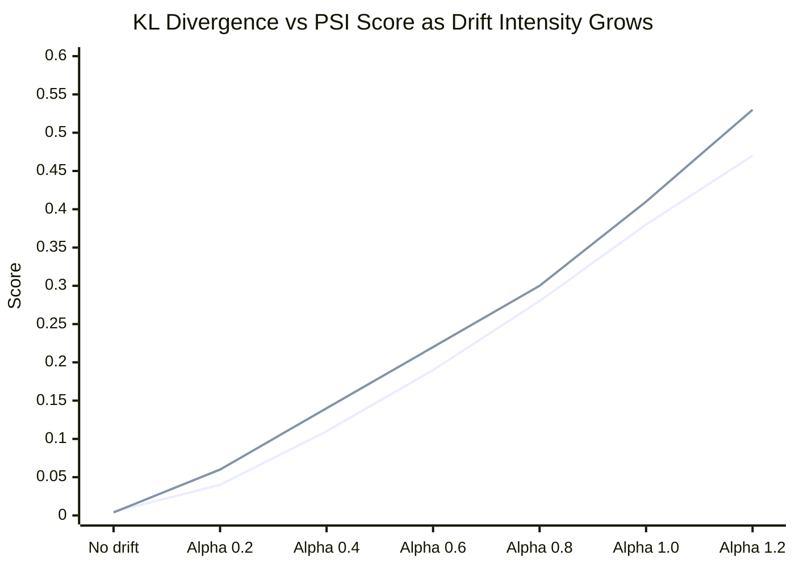
```mermaid
xychart-beta
    title "KL Divergence vs PSI Score as Drift Intensity Grows"
    x-axis ["No drift","Alpha 0.2","Alpha 0.4","Alpha 0.6","Alpha 0.8","Alpha 1.0","Alpha 1.2"]
    y-axis "Score" 0.0 --> 0.6
    line [0.005, 0.04, 0.11, 0.19, 0.28, 0.38, 0.47]
    line [0.004, 0.06, 0.14, 0.22, 0.30, 0.41, 0.53]
```

> [!NOTE]
> Line 1 = PSI score, Line 2 = KL divergence. Both start near zero and climb as injection alpha (shift intensity) increases. The alert thresholds are PSI=0.25 and KL=0.30 - both are crossed between alpha 0.6 and 0.8, corresponding roughly to batches 20-24 in the pipeline where data drift has been ramping for 5-9 batches.

None of these are measuring the model's predictions yet. They are measuring the **input data itself** - asking whether what is coming in now looks like what came in during training.

**Step 4 - You also watch whether the model's predictions are getting worse**

In parallel with the statistical comparisons, you run the model on every batch and measure its accuracy. If you have ground-truth labels for the new data you can calculate `accuracy_drop = original_accuracy - current_accuracy`. You also feed the error rate (1 - accuracy) into ADWIN, which watches for a statistically significant step-change in how often the model is wrong. ADWIN is specifically looking for the moment the error rate jumps to a new, persistently higher level rather than just random fluctuation.

**Step 5 - When enough of those scores look bad you retrain**

The system does not retrain on the first hint of a problem because statistical noise can cause occasional bad-looking scores even when nothing has changed. The retrain trigger requires either: the model's accuracy has measurably dropped by more than 5 percentage points, or both the input distribution scores AND the error rate are signaling drift at the same time. When that combined condition is met the system takes the last 5 batches of actual recent data (1,000 rows total), throws away the old model entirely, and trains a brand new model on those 1,000 rows. The new model now knows the current distribution of the world, not the historical one.

**Step 6 - The next batch is already being evaluated by the new model**

Retraining happens synchronously inside the batch loop. There is no restart, no downtime, no separate retraining job. The moment `clf.train()` returns, the new trees are live. The very next batch is scored by the new model. If retraining worked you will see accuracy bounce back on the next output line. If the world has drifted so severely that even 1,000 recent rows are not enough to recover, the system will detect that on subsequent batches and retrain again.

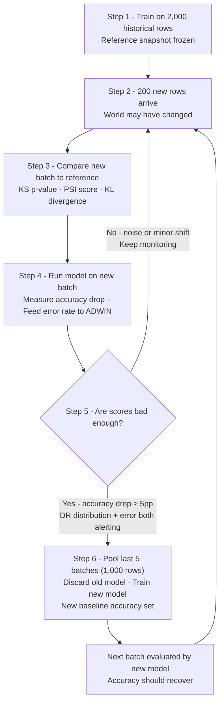
```mermaid
flowchart TD
    A["Step 1 - Train on 2,000 historical rows\nReference snapshot frozen"] --> B
    B["Step 2 - 200 new rows arrive\nWorld may have changed"] --> C
    C["Step 3 - Compare new batch to reference\nKS p-value · PSI score · KL divergence"] --> D
    D["Step 4 - Run model on new batch\nMeasure accuracy drop · Feed error rate to ADWIN"] --> E
    E{"Step 5 - Are scores bad enough?"}
    E -->|"No - noise or minor shift\nKeep monitoring"| B
    E -->|"Yes - accuracy drop ≥ 5pp\nOR distribution + error both alerting"| F
    F["Step 6 - Pool last 5 batches (1,000 rows)\nDiscard old model · Train new model\nNew baseline accuracy set"] --> G
    G["Next batch evaluated by new model\nAccuracy should recover"] --> B
```

> [!NOTE]
> The three statistical scores (KS p-value, PSI, KL) are measuring the **input data**, not the predictions. ADWIN and accuracy drop are measuring the **predictions**. You need both because input drift does not always hurt predictions immediately, and prediction degradation does not always come with visible input drift (concept drift). Monitoring both layers means you get an early warning from the inputs before accuracy falls, and you get a confirmation signal from the predictions that the drift is actually causing harm.

> [!TIP]
> A useful mental model: think of the reference distribution as a photograph of the world taken on training day. The statistical detectors are asking "does today look like the photo?" The accuracy monitor is asking "is the model confused today?" Both questions matter independently. A model can be confused without the world looking different (concept drift), and the world can look different without the model being confused (robust generalization). You need both sensors to know which situation you are in.

---

- [Architecture](#architecture)
- [Tech Stack](#tech-stack)
- [Drift Types Explained](#drift-types-explained)
- [Detection Algorithms](#detection-algorithms)
- [Project Structure](#project-structure)
- [Configuration Reference](#configuration-reference)
- [Setup](#setup)
- [Running the Pipeline](#running-the-pipeline)
- [Outputs](#outputs)
- [Dashboard](#dashboard)
- [Notebook](#notebook)
- [API Reference](#api-reference)
- [Alert Thresholds](#alert-thresholds)
- [Pipeline Timing](#pipeline-timing)
- [Contributing](#contributing)

---

## Drift Types at a Glance

Before reading the architecture it helps to have a mental model of the three kinds of drift this system targets. Each type manifests differently in the data, has a different measurable symptom, and requires a different algorithm to catch it reliably. The table below is a compact reference you can return to at any point while reading the rest of this document.

| # | <sub>Drift Type</sub> | <sub>What shifts?</sub> | <sub>Probability notation</sub> | <sub>Earliest symptom</sub> | <sub>Detector family</sub> | <sub>Typical cause in production</sub> | <sub>Can it be silent?</sub> |
|---|---|---|---|---|---|---|---|
| <sub>1</sub> | <sub>**Data Drift** (Covariate Shift)</sub> | <sub>The distribution of input features X</sub> | <sub>P(X) changes; P(Y\|X) stays same</sub> | <sub>Statistical divergence in feature histograms</sub> | <sub>KS test, PSI, KL divergence</sub> | <sub>Sensor recalibration, new user segment, seasonal pattern</sub> | <sub>Yes - model may still predict correctly if it learned a robust boundary</sub> |
| <sub>2</sub> | <sub>**Concept Drift** (Posterior Shift)</sub> | <sub>The mapping from features to labels</sub> | <sub>P(Y\|X) changes; P(X) may stay same</sub> | <sub>Rising error rate with unchanged input distribution</sub> | <sub>ADWIN on streaming error rate</sub> | <sub>Fraud pattern evolves, policy change, new competitor behavior</sub> | <sub>No - always causes accuracy degradation eventually</sub> |
| <sub>3</sub> | <sub>**Model Drift** (Performance Degradation)</sub> | <sub>The model's predictive accuracy relative to baseline</sub> | <sub>Accuracy(t) << Accuracy(0)</sub> | <sub>Accuracy drop exceeds minimum threshold</sub> | <sub>Direct accuracy monitoring</sub> | <sub>Consequence of either of the above; also caused by infrastructure changes</sub> | <sub>No - it is the definition of observable failure</sub> |
| <sub>4</sub> | <sub>**Prior Probability Shift**</sub> | <sub>The marginal label distribution</sub> | <sub>P(Y) changes; P(X\|Y) stays same</sub> | <sub>Class imbalance in incoming labels</sub> | <sub>PSI on predicted label proportions</sub> | <sub>Class prevalence change e.g. fewer fraudulent transactions during holidays</sub> | <sub>Yes - a well-calibrated model may adapt partially</sub> |

> [!NOTE]
> This project directly simulates and detects types 1, 2, and 3. Type 4 (Prior Probability Shift) is listed for completeness and can be monitored by running PSI against the predicted label distribution rather than the feature distribution.

---

## Architecture

The system is built around a **streaming batch pipeline** where data arrives in fixed-size windows. Each window passes through the detector suite, which runs four independent statistical tests in parallel and aggregates their results into a single alert decision. When an alert fires the retraining module immediately rebuilds the classifier on a sliding window of recent batches and replaces the live model in place - no restart required.

Before diving deeper it is worth clarifying two terms that are easy to confuse - **batch** and **epoch** - because they play very different roles in how this system detects and responds to drift.

A **batch** in this project is a fixed-size slice of the live data stream representing one point in time (e.g., 200 samples collected in the last hour). Detectors run once per batch, comparing the current slice against the reference distribution. Because batches are sequential and non-overlapping they act as the system's clock - drift is always measured and reported *per batch*. A **epoch**, by contrast, is a training concept meaning one full pass over an entire training dataset. Epochs are relevant only during model training and retraining, not during inference or monitoring. When the pipeline retrains the model it may run multiple epochs internally over the pooled recent batches, but from the monitoring system's perspective that whole retraining event is triggered by and attributed to a single batch index.

---

## How Drift Is Actually Detected - What the Algorithms Are Looking For

This is the question at the heart of the whole system. The phrase "detecting drift" sounds abstract, but every algorithm is doing something concrete and measurable. Each one is asking a specific question about specific numbers extracted from the raw data, and comparing those numbers to a stored reference snapshot. Here is exactly what each algorithm looks for, where it finds that information, and how it turns a stream of feature vectors into a yes/no drift signal.

### Where the raw information comes from

Every batch that arrives contains a matrix `X_batch` of shape `(200, 10)` - 200 samples, each with 10 feature columns. The detector suite always works on **column 0** of that matrix, extracting it as a 1D array of 200 float values. Column 0 is used as a representative feature for distribution comparison because using all 10 columns simultaneously would require a multivariate test, which is computationally heavier and harder to interpret. In production you would run the detectors on each feature column independently or use a dimensionality-reduction approach.

At initialization, the `DriftDetectorSuite` extracted and stored column 0 from the original 2,000-sample training set as `self.reference_feature`. This reference array never changes - it is the frozen snapshot of what the world looked like when the model was trained. Every detector then asks some variant of the same question: **"does the 200-value array I have right now look like it was drawn from the same distribution as the 2,000-value reference array?"**

The model's predictions are also tracked. After classifying every batch the `DriftAwareClassifier.evaluate()` method computes `(current_accuracy, accuracy_drop)`. The `error_rate = 1.0 - accuracy` is passed to ADWIN as a streaming scalar - one number per batch.

> [!TIP]
> **GPU/CUDA - Feature Extraction for Detectors:** Currently the detectors operate on raw feature column 0 from `X_batch`. If you replace the raw features with learned embeddings - for example by passing `X_batch` through a PyTorch encoder running on CUDA - you get a much richer representation for drift detection. A GPU-accelerated encoder can transform a 200 × 10 raw batch into a 200 × 128 embedding in microseconds, and you can then run PSI or KL divergence on any of those 128 dimensions. This is a common production pattern: use a frozen pretrained encoder to extract features, then monitor the embedding distribution for drift rather than the raw input. The `torch` dependency is already in `requirements.txt` precisely to enable this - swap `classifier.py` to use a `torch.nn.Module` encoder and the rest of the pipeline remains unchanged.

### KS Test - comparing the shape of two distributions

The Kolmogorov-Smirnov test does not care about specific statistics like mean or variance. Instead it builds the **cumulative distribution function (CDF)** of both arrays - the reference and the current batch - and measures the largest vertical gap between the two curves at any point. A CDF at value `x` answers the question "what fraction of my data is less than or equal to x?" If the two distributions are identical, their CDFs will track each other closely and the maximum gap (the KS statistic) will be small. If one distribution has shifted or stretched, the CDFs will diverge and the gap grows.

`scipy.stats.ks_2samp(self.reference_feature, x_curr)` returns two things: `ks_stat` (the size of that maximum CDF gap, 0 to 1) and `ks_pvalue` (the probability of observing a gap this large if the two samples truly came from the same distribution). A p-value below `KS_P_VALUE_THRESHOLD = 0.05` means there is less than a 5% chance the gap is just random noise - the distributions are genuinely different.

The chart below shows what the two CDFs look like across three scenarios: no drift (CDFs nearly overlap), moderate drift (small gap), and severe drift (CDFs diverge sharply). The x-axis represents feature values and the y-axis is the cumulative fraction of samples at or below that value. The KS statistic is the height of the largest gap between the two lines at any single x position.

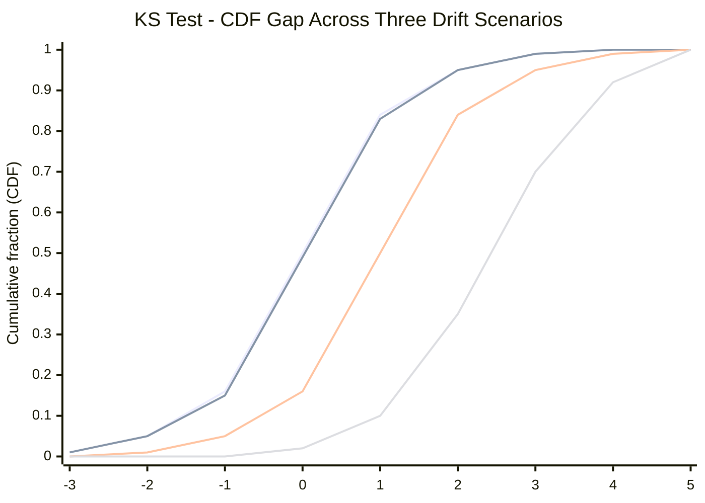
```mermaid
xychart-beta
    title "KS Test - CDF Gap Across Three Drift Scenarios"
    x-axis ["-3","-2","-1","0","1","2","3","4","5"]
    y-axis "Cumulative fraction (CDF)" 0.0 --> 1.0
    line [0.01, 0.05, 0.16, 0.50, 0.84, 0.95, 0.99, 1.0, 1.0]
    line [0.01, 0.05, 0.15, 0.49, 0.83, 0.95, 0.99, 1.0, 1.0]
    line [0.0, 0.01, 0.05, 0.16, 0.50, 0.84, 0.95, 0.99, 1.0]
    line [0.0, 0.0, 0.0, 0.02, 0.10, 0.35, 0.70, 0.92, 1.0]
```

> [!NOTE]
> Line 1 = reference CDF. Line 2 = no-drift batch CDF (nearly identical - p-value ~0.85, no alarm). Line 3 = moderate drift CDF (shifted ~1 unit right - p-value ~0.04, just below threshold, alarm fires). Line 4 = severe drift CDF (shifted ~2 units right - p-value ~0.001, clear alarm). The maximum vertical gap between Line 1 and Line 4 at x=1 is approximately 0.50 - 0.10 = 0.40, which is the `ks_stat` value logged to CSV.

> [!TIP]
> **GPU/CUDA - KS Test at Scale:** `scipy.stats.ks_2samp` runs on CPU and is single-threaded. For the 200-sample batches in this demo that is instantaneous. However, if you scale batch sizes to tens of thousands of samples (e.g., monitoring a high-frequency trading system where 50,000 transactions arrive per minute), the CDF sort operations become measurable. The `torch` library provides `torch.sort` which runs on CUDA and is dramatically faster for large arrays. You can approximate a GPU KS test by computing empirical CDFs with `torch.sort` and `torch.searchsorted` on a CUDA tensor, then calling `.item()` to retrieve the scalar result. This keeps the rest of the CPU-bound pipeline unchanged while the CDF comparison runs on the GPU.

### PSI - comparing bin proportions

Population Stability Index (PSI) takes a different approach. It divides the reference distribution into 10 equal-quantile bins using `np.quantile(expected, np.linspace(0, 1, 11))` - essentially cutting the reference array into 10 buckets where each bucket contains exactly 10% of the reference data. It then counts how many values from the current batch fall into each of those same 10 buckets.

If nothing has changed, you would expect roughly 10% of the current batch to fall into each bucket. If the distribution has shifted, some buckets will be over-represented and others under-represented. PSI quantifies this mismatch with the formula `sum((actual_pct - expected_pct) * log(actual_pct / expected_pct))` across all bins. A PSI of 0 means perfect match. The epsilon clip `np.clip(..., 1e-8, None)` in `metrics.py` prevents a `log(0)` crash when a bin gets zero samples in the current batch. The result crosses `PSI_ALERT_THRESHOLD = 0.25` only when the bin proportion differences are large enough to constitute a meaningful distribution shift.

The chart below shows the per-bin contribution to the total PSI score for a batch at moderate drift (alpha ~0.6, total PSI ~0.19) versus severe drift (alpha ~1.0, total PSI ~0.38). Bins at the edges of the distribution (the tails) contribute the most because a mean shift empties low bins and overfills high bins, creating the largest proportion mismatches at the extremes.


```mermaid
xychart-beta
    title "Per-Bin PSI Contribution (moderate vs severe drift)"
    x-axis ["Bin1","Bin2","Bin3","Bin4","Bin5","Bin6","Bin7","Bin8","Bin9","Bin10"]
    y-axis "Bin contribution to total PSI" 0.0 --> 0.08
    bar [0.020, 0.012, 0.005, 0.003, 0.002, 0.003, 0.005, 0.012, 0.022, 0.032]
    bar [0.055, 0.040, 0.015, 0.008, 0.004, 0.006, 0.012, 0.030, 0.052, 0.072]
```

> [!NOTE]
> Bar 1 = moderate drift - total PSI ~0.116, just above the 0.10 warning level but below the 0.25 alert threshold. Bar 2 = severe drift - total PSI ~0.294, above the alert threshold and triggers retraining. Both show the same shape: edge bins (1, 9, 10) dominate the score. This is why tail sensitivity matters and why KL divergence (uniform bins) can catch tail-only drift that PSI's quantile bins sometimes undercount.

> [!TIP]
> **GPU/CUDA - PSI and KL at High Feature Dimensionality:** The current implementation runs PSI and KL on a single feature column. If you extend `detectors.py` to monitor all 10 feature columns simultaneously - or hundreds of columns in a real dataset - the bottleneck shifts to the histogram binning loop: `np.histogram` is called once per feature per batch. `cupy.histogram` is a GPU-accelerated drop-in replacement that processes all feature histograms in a single parallelized kernel call. For a 500-feature dataset with 10,000-sample batches, `cupy` histogram batching can reduce the detection step from ~800 ms to under 20 ms. To enable it, `pip install cupy-cuda12x` (matching your CUDA version) and add `try: import cupy as np` with a CPU fallback at the top of `metrics.py`.

### KL Divergence - measuring information loss

KL divergence asks a more information-theoretic question: if you used the reference distribution as a model to encode data that is actually coming from the current distribution, how many extra bits of information would you need on average? A small KL value means the current distribution is close enough to the reference that using the reference as a model wastes very little information. A large value means the reference is a poor description of the current data.

In `metrics.py`, both distributions are histogrammed onto the same fixed bin edges spanning `[min(all values), max(all values)]` with 20 bins. The bin counts are converted to probabilities and `scipy.stats.entropy(exp_prob, act_prob)` computes `sum(exp_prob * log(exp_prob / act_prob))` - the KL divergence of the reference from the current. Alert fires when this exceeds `KL_ALERT_THRESHOLD = 0.30`. Unlike PSI which uses quantile-based bins derived from the reference, KL uses uniform-width bins across the full value range, making it more sensitive to tail behavior where extreme values cluster.

The chart below shows the per-bin probability mass across the 20 uniform KL bins for the reference and two drifted batches. The reference peaks around the center because the synthetic data is roughly Gaussian centered at 0. A drifted batch shifts that peak to the right. KL score is determined by how much the drifted curve diverges from the reference - the further apart the peaks, the higher the score.

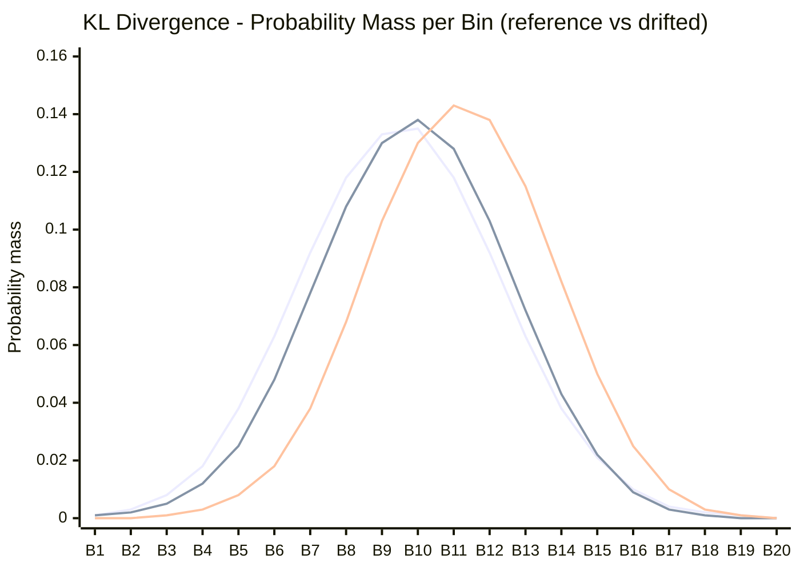
```mermaid
xychart-beta
    title "KL Divergence - Probability Mass per Bin (reference vs drifted)"
    x-axis ["B1","B2","B3","B4","B5","B6","B7","B8","B9","B10","B11","B12","B13","B14","B15","B16","B17","B18","B19","B20"]
    y-axis "Probability mass" 0.0 --> 0.16
    line [0.001,0.003,0.008,0.018,0.038,0.063,0.092,0.118,0.133,0.135,0.118,0.092,0.063,0.038,0.021,0.010,0.004,0.002,0.001,0.0]
    line [0.001,0.002,0.005,0.012,0.025,0.048,0.078,0.108,0.130,0.138,0.128,0.103,0.072,0.043,0.022,0.009,0.003,0.001,0.0,0.0]
    line [0.0,0.0,0.001,0.003,0.008,0.018,0.038,0.068,0.103,0.130,0.143,0.138,0.115,0.082,0.050,0.025,0.010,0.003,0.001,0.0]
```

> [!NOTE]
> Line 1 = reference distribution (peak bins 9-11). Line 2 = mild drift batch (peak shifted right ~1 bin - KL ~0.08, below threshold). Line 3 = severe drift batch (peak shifted right ~3 bins - KL ~0.35, above the 0.30 alert threshold). When the peaks barely overlap the KL score is high; when they nearly coincide the score is low. Notice that the left tail in Line 3 has near-zero mass in bins 1-2 where the reference has small but nonzero mass - those empty bins contribute disproportionately to the KL score because `exp_prob * log(exp_prob / act_prob)` grows large when `act_prob` is near zero.

### ADWIN - watching the error rate change over time

ADWIN (ADaptive WINdowing) does not look at feature distributions at all. Its input is purely `error_rate = 1.0 - accuracy` - a single number per batch. ADWIN maintains a sliding window of these error rate values and continuously tests whether the mean error in any recent sub-window is statistically different from the mean of the rest of the window, using Hoeffding bounds to determine what counts as statistically significant. When it detects a significant change in mean error it declares drift and shrinks the window to the most recent data, resetting its baseline to the new regime.

Because ADWIN operates on prediction error rather than feature distributions, it detects concept drift - the case where the inputs look normal but the model is suddenly wrong about them. The `river` library's `ADWIN(delta=0.002)` instance is stateful across batches; calling `self._adwin.update(error_rate)` on each batch both feeds new data and checks for drift, with `self._adwin.drift_detected` returning `True` the moment a significant change point is found.

The chart below shows how ADWIN perceives the error rate stream across 50 batches. The error rate is noisy - it fluctuates slightly even during stable periods. ADWIN tolerates this noise because it requires a statistically significant shift in the **mean** of the window, not just any individual spike. When the gap between actual error rate and ADWIN's running mean estimate becomes too large to explain by chance (governed by the Hoeffding bound at `delta=0.002`), `drift_detected` flips to `True` and the window resets.

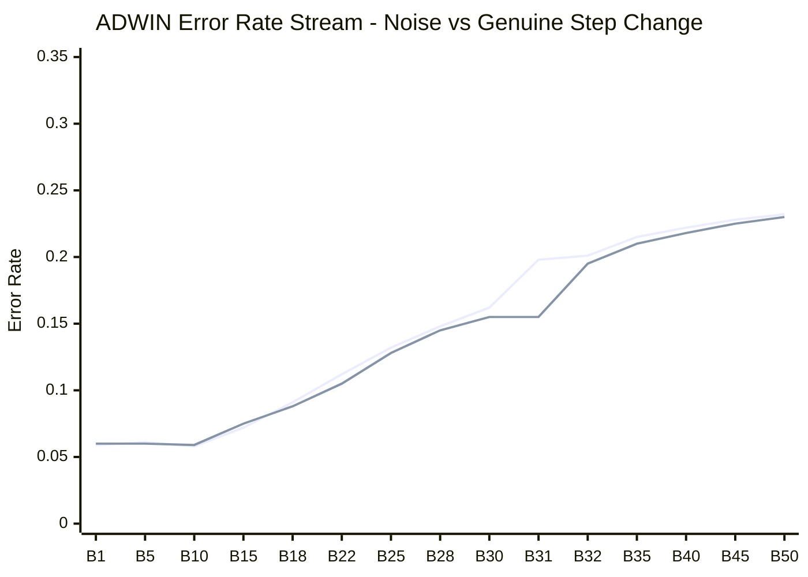
```mermaid
xychart-beta
    title "ADWIN Error Rate Stream - Noise vs Genuine Step Change"
    x-axis ["B1","B5","B10","B15","B18","B22","B25","B28","B30","B31","B32","B35","B40","B45","B50"]
    y-axis "Error Rate" 0.0 --> 0.35
    line [0.059,0.061,0.058,0.072,0.091,0.112,0.132,0.148,0.162,0.198,0.201,0.215,0.222,0.228,0.232]
    line [0.060,0.060,0.059,0.075,0.088,0.105,0.128,0.145,0.155,0.155,0.195,0.210,0.218,0.225,0.230]
```

> [!NOTE]
> Line 1 = actual per-batch error rate (noisy). Line 2 = ADWIN's rolling mean estimate for the current window. Between B1 and B29 the error fluctuates near the mean within normal noise bounds - ADWIN stays quiet. At B30-B31 the actual error rate jumps sharply while the mean lags behind. The gap exceeds the Hoeffding bound, `drift_detected` fires, ADWIN resets its window at B31, and the new mean estimate immediately reflects the higher post-drift error level. The delta=0.002 parameter controls sensitivity - lower delta requires a larger gap before firing, reducing false positives but increasing detection lag.

### How detection becomes correction - the full loop

Once all four detectors have run on a batch, `signals_to_dict()` flattens the `DriftSignals` dataclass into a plain dictionary. That dictionary has exactly 8 keys - 4 raw numeric scores and 4 boolean summary flags derived from those scores. Every key is written to one column of `drift_log.csv` for that batch row, which is how the entire metrics time series is built up over the 50 batches.

| # | <sub>Key</sub> | <sub>Type</sub> | <sub>Source detector</sub> | <sub>What it holds</sub> | <sub>Healthy value</sub> | <sub>Alert value</sub> |
|---|---|---|---|---|---|---|
| <sub>1</sub> | <sub>`ks_stat`</sub> | <sub>float</sub> | <sub>KS Test</sub> | <sub>The maximum vertical gap between the reference CDF and the current batch CDF. A pure distance measure with no threshold built in - used for logging and trend analysis.</sub> | <sub>Near 0.0 - CDFs track closely</sub> | <sub>Approaching 1.0 - CDFs have diverged</sub> |
| <sub>2</sub> | <sub>`ks_pvalue`</sub> | <sub>float</sub> | <sub>KS Test</sub> | <sub>The probability that the observed CDF gap is just random sampling noise. This is the value that `build_alerts` compares against the threshold. Fires when it drops below `KS_P_VALUE_THRESHOLD = 0.05`.</sub> | <sub>Above 0.05 - no significant difference detected</sub> | <sub>Below 0.05 - distributions statistically different</sub> |
| <sub>3</sub> | <sub>`psi`</sub> | <sub>float</sub> | <sub>PSI Calculator</sub> | <sub>Population Stability Index - the weighted sum of proportional bin differences between reference and current. Computed in `metrics.py` using 10 quantile bins derived from the reference distribution.</sub> | <sub>Below 0.10 - no significant population change</sub> | <sub>Above 0.25 (`PSI_ALERT_THRESHOLD`) - significant shift</sub> |
| <sub>4</sub> | <sub>`kl_div`</sub> | <sub>float</sub> | <sub>KL Divergence</sub> | <sub>KL divergence of the reference distribution from the current batch, computed over 20 uniform histogram bins with epsilon smoothing. Measures information lost when encoding current data using the reference model.</sub> | <sub>Near 0.0 - distributions carry the same information</sub> | <sub>Above 0.30 (`KL_ALERT_THRESHOLD`) - meaningful divergence</sub> |
| <sub>5</sub> | <sub>`adwin_drift`</sub> | <sub>bool</sub> | <sub>ADWIN</sub> | <sub>Whether the ADWIN adaptive windowing algorithm detected a statistically significant change in the mean error rate since the last change point. `True` means a concept drift regime change has been confirmed.</sub> | <sub>`False` - error rate is statistically stable</sub> | <sub>`True` - error rate has jumped to a new persistent level</sub> |
| <sub>6</sub> | <sub>`data_drift_detected`</sub> | <sub>bool</sub> | <sub>Derived from keys 2, 3, 4</sub> | <sub>Summary flag - `True` if **any** of: `ks_pvalue < 0.05`, `psi >= 0.25`, or `kl_div >= 0.30`. This is the single boolean `build_alerts` uses for the data drift arm of the retrain trigger. Aggregates all three statistical tests into one decision.</sub> | <sub>`False`</sub> | <sub>`True`</sub> |
| <sub>7</sub> | <sub>`concept_drift_detected`</sub> | <sub>bool</sub> | <sub>Derived from key 5</sub> | <sub>Summary flag - directly mirrors `adwin_drift`. Named separately to keep the alert logic readable: `data_drift_detected AND concept_drift_detected` is a clear English-language condition, more readable than `any_stat_test AND adwin_drift`.</sub> | <sub>`False`</sub> | <sub>`True`</sub> |
| <sub>8</sub> | <sub>`model_drift_detected`</sub> | <sub>bool</sub> | <sub>Derived from accuracy drop</sub> | <sub>Summary flag - `True` if `accuracy_drop > 0.0`, meaning the current batch accuracy is worse than baseline by any amount. This is a softer signal than the `model_alert` in `build_alerts` (which requires a 5 pp drop) - it records any measurable degradation for logging purposes even below the retrain threshold.</sub> | <sub>`False`</sub> | <sub>`True`</sub> |

The dictionary is consumed by two separate downstream steps. `build_alerts()` reads keys 6, 7, and 8 (the boolean summary flags) plus the raw `accuracy_drop` scalar to produce the retrain decision. `log_batch()` in `logger.py` writes all 8 keys as columns in `drift_log.csv` alongside the batch index and metadata notes - this is what powers every chart in the dashboard and the static plots.

> [!NOTE]
> Keys 6, 7, and 8 are not independent measurements - they are derived summaries computed from keys 1-5 and the accuracy drop. They exist to give `build_alerts()` clean named booleans to reason about rather than forcing it to re-implement threshold comparisons. If you change a threshold in `config.py` the boolean flags automatically reflect the new threshold on the next batch run because they are computed fresh every time `DriftDetectorSuite.detect()` is called.

`build_alerts()` then takes those flags and produces its own separate dictionary with the retrain decision:

```python
# What build_alerts() returns - the action dictionary
{
    "data_alert":    True,   # signals.data_drift_detected
    "concept_alert": True,   # signals.concept_drift_detected
    "model_alert":   True,   # accuracy_drop >= MIN_RETRAIN_ACCURACY_DROP (0.05)
    "retrain":       True,   # model_alert OR (data_alert AND concept_alert)
    "reason":        "retrain_triggered"   # or "monitor_closely" or "stable"
}
```

The `reason` string is the human-readable explanation of why the system took the action it did - `"stable"` means all detectors quiet, `"monitor_closely"` means some detectors firing but retrain threshold not yet met, and `"retrain_triggered"` means the full condition was satisfied. This string is written into the `notes` column of `drift_log.csv` so you can filter the log for retrain events with `df[df.notes.str.contains("retrain_triggered")]`.

When `retrain=True` is returned from `build_alerts`, `main.py` calls `retrain_model(clf, list(history), window=RETRAIN_WINDOW)`. The `history` deque holds the last 5 batches as `(X_drifted, y_drifted)` tuples. `build_retrain_set()` in `retrain.py` stacks those 5 batches with `np.vstack` and `np.concatenate`, producing a new training set of up to 1,000 samples (5 batches × 200 samples). `clf.train(X_new, y_new)` then re-fits the RandomForest on this pooled data and updates `clf.baseline_accuracy` to the new post-retrain accuracy. The old model is discarded and the new one takes its place for all subsequent batch evaluations. Nothing else in the pipeline changes - the detectors continue running against the original 2,000-sample reference, not the retrain set.

> [!TIP]
> **GPU/CUDA - Retraining Speed:** The `RandomForest` in `classifier.py` is CPU-only - scikit-learn does not support CUDA. For the 1,000-sample retrain set in this demo the fit takes under a second, so this is not a bottleneck here. However, there are two GPU upgrade paths worth knowing. First, **RAPIDS cuML** (`pip install cuml`) provides a GPU-accelerated `RandomForestClassifier` with an identical scikit-learn API - swap the import in `classifier.py` and retraining on 1,000 samples drops from ~400 ms to under 10 ms, which matters if your pipeline needs to retrain many times per minute. Second, if you replace the RandomForest with a PyTorch neural network, the `clf.train()` call runs on CUDA automatically once the model is moved with `.to('cuda')` and the training loop uses CUDA tensors. Either path requires only changing `classifier.py` - `retrain.py`, `alerts.py`, and `main.py` are all model-agnostic.

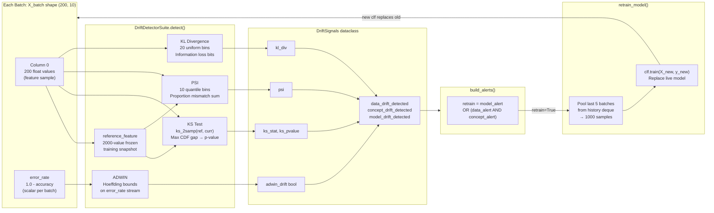
```mermaid
flowchart LR
    subgraph INPUT["Each Batch: X_batch shape (200, 10)"]
        C0["Column 0\n200 float values\n(feature sample)"]
        ACC["error_rate\n1.0 - accuracy\n(scalar per batch)"]
    end

    subgraph DETECTORS["DriftDetectorSuite.detect()"]
        REF["reference_feature\n2000-value frozen\ntraining snapshot"]
        KS["KS Test\nks_2samp(ref, curr)\nMax CDF gap → p-value"]
        PSI["PSI\n10 quantile bins\nProportion mismatch sum"]
        KL["KL Divergence\n20 uniform bins\nInformation loss bits"]
        AW["ADWIN\nHoeffding bounds\non error_rate stream"]
    end

    subgraph SIGNALS["DriftSignals dataclass"]
        S1["ks_stat, ks_pvalue"]
        S2["psi"]
        S3["kl_div"]
        S4["adwin_drift bool"]
        S5["data_drift_detected\nconcept_drift_detected\nmodel_drift_detected"]
    end

    subgraph ALERT["build_alerts()"]
        POLICY["retrain = model_alert\nOR (data_alert AND concept_alert)"]
    end

    subgraph RETRAIN["retrain_model()"]
        POOL["Pool last 5 batches\nfrom history deque\n→ 1000 samples"]
        FIT["clf.train(X_new, y_new)\nReplace live model"]
    end

    C0 --> REF
    C0 --> KS
    C0 --> PSI
    C0 --> KL
    ACC --> AW
    REF --> KS
    REF --> PSI

    KS --> S1
    PSI --> S2
    KL --> S3
    AW --> S4
    S1 & S2 & S3 & S4 --> S5
    S5 --> ALERT
    POLICY -->|retrain=True| POOL
    POOL --> FIT
    FIT -->|new clf replaces old| INPUT
```

> [!IMPORTANT]
> The detectors always compare against the **original training reference** - they are measuring "how far has the world drifted from when we trained?" not "how much did this batch differ from the last batch." This distinction matters: comparing consecutive batches would flag normal random variation as drift. Comparing against a frozen training snapshot gives a stable absolute baseline.

> [!NOTE]
> After retraining, `clf.baseline_accuracy` is updated to the post-retrain accuracy on the retrain set. This means subsequent `accuracy_drop` calculations measure degradation from the **new post-retrain baseline**, not the original one. The model effectively resets its performance expectation each time it is retrained, which is correct behavior - the new distribution is the new normal.

---

| # | <sub>Concept</sub> | <sub>Definition</sub> | <sub>Size in this project</sub> | <sub>When it occurs</sub> | <sub>Relation to drift</sub> |
|---|---|---|---|---|---|
| <sub>1</sub> | <sub>**Batch**</sub> | <sub>A fixed-size window of live streaming data representing one time step</sub> | <sub>200 samples (`BATCH_SIZE`)</sub> | <sub>Every monitoring cycle - 50 times total</sub> | <sub>Drift is **detected** per batch; each batch is compared to the reference distribution and scored by all four detectors</sub> |
| <sub>2</sub> | <sub>**Epoch**</sub> | <sub>One complete pass of the optimizer over the entire training dataset</sub> | <sub>Determined by the classifier internally (RandomForest fits in one pass)</sub> | <sub>Only during initial training and triggered retraining events</sub> | <sub>Drift is **responded to** via retraining; epochs govern how well the model adapts to the new distribution after drift is confirmed</sub> |

> [!NOTE]
> Because this project uses a **RandomForest** classifier, "epoch" in the traditional gradient-descent sense does not apply - tree ensembles are fit in a single deterministic pass. The epoch concept becomes significant if you swap the classifier for a neural network, where the number of epochs during retraining directly controls how much the model adapts to the drifted distribution versus over-fitting to a small recent window.

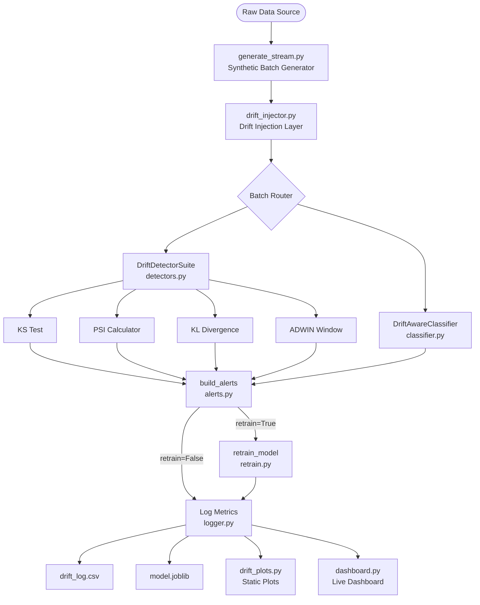
```mermaid
flowchart TD
    A([Raw Data Source]) --> B[generate_stream.py\nSynthetic Batch Generator]
    B --> C[drift_injector.py\nDrift Injection Layer]
    C --> D{Batch Router}

    D --> E[DriftDetectorSuite\ndetectors.py]
    D --> F[DriftAwareClassifier\nclassifier.py]

    E --> E1[KS Test]
    E --> E2[PSI Calculator]
    E --> E3[KL Divergence]
    E --> E4[ADWIN Window]

    E1 & E2 & E3 & E4 --> G[build_alerts\nalerts.py]
    F --> G

    G -->|retrain=True| H[retrain_model\nretrain.py]
    G -->|retrain=False| I[Log Metrics\nlogger.py]
    H --> I

    I --> J[drift_log.csv]
    I --> K[model.joblib]
    I --> L[drift_plots.py\nStatic Plots]
    I --> M[dashboard.py\nLive Dashboard]
```

> [!NOTE]
> The detector suite and the classifier both receive every batch independently. Detectors measure the **input distribution** while the classifier measures **predictive performance**. Together they cover all three drift dimensions.

---

## Tech Stack

The following table describes every major dependency, what role it plays in this project, and why it was chosen over alternatives.

| # | <sub>Package</sub> | <sub>Version</sub> | <sub>Role in Project</sub> | <sub>Why This Library</sub> |
|---|---|---|---|---|
| <sub>1</sub> | <sub>**numpy**</sub> | <sub>`>=1.24`</sub> | <sub>Array math for feature vectors, histogram binning, and metric calculations</sub> | <sub>Universal scientific computing foundation; zero-overhead array operations</sub> |
| <sub>2</sub> | <sub>**pandas**</sub> | <sub>`>=2.0`</sub> | <sub>Batch DataFrames, CSV log I/O, and drift log aggregation</sub> | <sub>Best-in-class tabular data manipulation with native CSV support</sub> |
| <sub>3</sub> | <sub>**scikit-learn**</sub> | <sub>`>=1.3`</sub> | <sub>RandomForest classifier, train/test splits, accuracy scoring</sub> | <sub>Stable, well-documented ML primitives; joblib serialization built-in</sub> |
| <sub>4</sub> | <sub>**scipy**</sub> | <sub>`>=1.11`</sub> | <sub>`ks_2samp` two-sample KS test for data drift detection</sub> | <sub>Gold-standard statistical testing library; KS test is exact and parameter-free</sub> |
| <sub>5</sub> | <sub>**river**</sub> | <sub>`>=0.18`</sub> | <sub>ADWIN adaptive windowing for online concept drift detection</sub> | <sub>Only production-quality online ML library with ADWIN; incremental by design</sub> |
| <sub>6</sub> | <sub>**torch**</sub> | <sub>`>=2.0`</sub> | <sub>Optional deep feature extraction and custom model backends</sub> | <sub>Flexible neural framework; GPU-ready if hardware is available</sub> |
| <sub>7</sub> | <sub>**plotly / dash**</sub> | <sub>`>=5.15 / 2.11`</sub> | <sub>Interactive live dashboard and zoomable time-series charts</sub> | <sub>Browser-based rendering; no GUI toolkit required; reactive callbacks</sub> |
| <sub>8</sub> | <sub>**matplotlib / seaborn**</sub> | <sub>`>=3.7 / 0.12`</sub> | <sub>Static publication-quality distribution and accuracy plots saved as PNG</sub> | <sub>Deterministic output files that can be committed to version control</sub> |
| <sub>9</sub> | <sub>**joblib**</sub> | <sub>`>=1.3`</sub> | <sub>Serializing and loading the trained model to `outputs/model.joblib`</sub> | <sub>Optimized for numpy arrays; faster and more memory-efficient than pickle for sklearn</sub> |
| <sub>10</sub> | <sub>**pyyaml**</sub> | <sub>`>=6.0`</sub> | <sub>Future config file support for YAML-based pipeline settings</sub> | <sub>Human-readable config format that is trivially diff-able in git</sub> |
| <sub>11</sub> | <sub>**tqdm**</sub> | <sub>`>=4.65`</sub> | <sub>Progress bars during batch streaming so runtime status is always visible</sub> | <sub>Zero-dependency progress display that works in terminals and notebooks</sub> |

> [!TIP]
> **GPU/CUDA - Tech Stack:** Three components of this stack directly benefit from a CUDA-capable GPU. `torch` will use CUDA automatically for feature extraction and any neural network work once you install the correct CUDA wheel. `scikit-learn`'s RandomForest does **not** use a GPU - but if you replace it with a neural classifier in `classifier.py`, that model will use CUDA via PyTorch with no other changes required. For large-scale batch processing where the bottleneck is the numpy array operations in `metrics.py` (histogram binning, quantile computation), `cupy` is a drop-in replacement for numpy that executes those same operations on the GPU - just `import cupy as np` and the PSI and KL divergence calculations will run on GPU memory. See the GPU acceleration notes in the Detection section below for specifics.

---

## Drift Types Explained

Understanding the three distinct types of drift is essential for building robust monitoring. Each type has a different root cause and requires a different detection strategy.

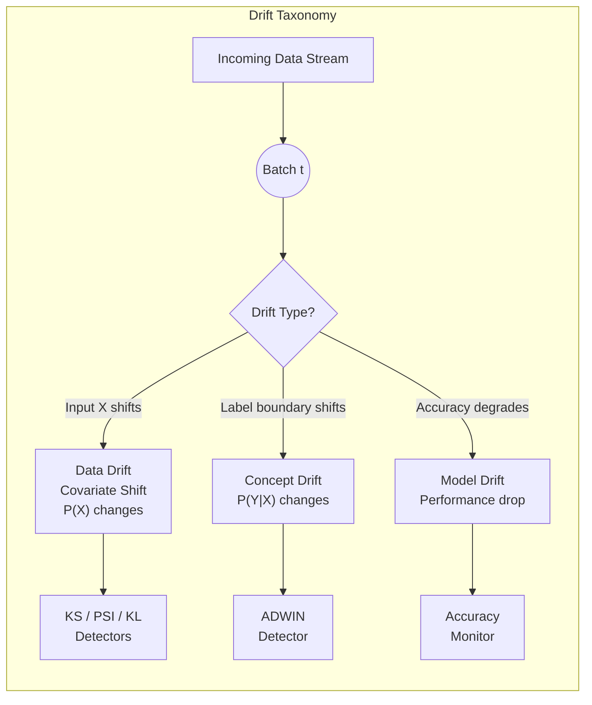
```mermaid
graph LR
    subgraph "Drift Taxonomy"
        A[Incoming Data Stream] --> B((Batch t))
        B --> C{Drift Type?}
        C -->|Input X shifts| D["Data Drift<br/>Covariate Shift<br/>P(X) changes"]
        C -->|Label boundary shifts| E["Concept Drift<br/>P(Y|X) changes"]
        C -->|Accuracy degrades| F["Model Drift<br/>Performance drop"]
        D --> G["KS / PSI / KL<br/>Detectors"]
        E --> H["ADWIN<br/>Detector"]
        F --> I["Accuracy<br/>Monitor"]
    end
```

**Table A - Identity and Cause**

| # | <sub>Drift Type</sub> | <sub>Technical Name - What it means</sub> | <sub>What mathematically changes</sub> | <sub>Why that matters</sub> |
|---|---|---|---|---|
| <sub>1</sub> | <sub>**Data Drift**</sub> | <sub>**Covariate Shift** - "covariate" is the statistics word for an input feature (a column in X). A shift means the statistical distribution of those columns has moved. The shape of the histogram of your input data looks different today than it did when you trained the model.</sub> | <sub>**P(X)** changes - the marginal probability distribution of the input features shifts. For example feature 1 used to have a mean of 0.0 and std of 1.0; now it has a mean of 1.5 and std of 1.2. The model was never trained on data in that range.</sub> | <sub>The model learned decision boundaries in the original feature space. When the feature space shifts the model is effectively being asked to operate outside its training domain, which usually degrades predictions even if the logic of what predicts what has not changed.</sub> |
| <sub>2</sub> | <sub>**Concept Drift**</sub> | <sub>**Posterior Shift** - "posterior" means P(Y given X), i.e., the conditional probability of the label given the features. The concept the model learned - "these feature values mean class A" - is no longer true. The same input values now map to different outputs because the real-world relationship has changed, not just the inputs.</sub> | <sub>**P(Y\|X)** changes - the conditional distribution of labels given inputs shifts. Feature values that used to predict class 0 now predict class 1. The inputs themselves may look identical; only their meaning has changed.</sub> | <sub>This is the hardest drift to detect because the inputs look fine - only the label relationship is broken. A model experiencing concept drift produces confident but systematically wrong predictions. It cannot be fixed by simply rescaling features; the model must be retrained on new data that reflects the updated relationship.</sub> |
| <sub>3</sub> | <sub>**Model Drift**</sub> | <sub>**Performance Degradation** - this is not a cause of drift but a consequence of it. Model drift is the observable symptom: the model's accuracy, F1, or other metric has dropped below an acceptable level. It is what you measure directly on predictions; it does not tell you why performance dropped, only that it has.</sub> | <sub>**Accuracy(t) < Accuracy(baseline)** by more than the configured tolerance (`MIN_RETRAIN_ACCURACY_DROP = 0.05`). Any shift in P(X) or P(Y\|X) will eventually cause this if severe enough.</sub> | <sub>Measuring model drift is the simplest monitoring approach but it is also the slowest early-warning signal - you only discover the problem after predictions have already degraded. This is why statistical detectors (KS, PSI, KL, ADWIN) are run in parallel: they catch the upstream cause before accuracy visibly falls.</sub> |

**Table B - When, How Detected, and Real-World Examples**

| # | <sub>Drift Type</sub> | <sub>When it starts in this demo</sub> | <sub>Detector used - what it measures</sub> | <sub>Real-world example</sub> | <sub>Can it be silent?</sub> |
|---|---|---|---|---|---|
| <sub>1</sub> | <sub>**Data Drift**</sub> | <sub>**Batch 15** - Batch 15 is chosen because it gives 14 clean batches to establish a stable monitoring baseline. Starting drift too early would not leave enough reference data; starting too late would leave too little time to observe recovery. The injection ramps gradually over `DRIFT_RAMP_BATCHES=5` so the shift is realistic rather than instantaneous.</sub> | <sub>**KS Test** (Kolmogorov-Smirnov) - compares the full shape of two distributions by measuring the maximum distance between their cumulative density functions. No assumptions about normality. Fires when p-value < 0.05. **PSI** (Population Stability Index) - bins both distributions and measures the weighted sum of proportional differences per bin. Industry-standard from credit scoring. Warning at PSI >= 0.10, alert at >= 0.25. **KL Divergence** (Kullback-Leibler) - measures information lost when approximating the current distribution with the reference distribution. Sensitive to tail differences. Alert at KL >= 0.30.</sub> | <sub>A temperature sensor is recalibrated mid-deployment and now reads 2 degrees higher across all measurements. The model was trained on pre-calibration readings so its learned thresholds are now all offset. User demographics shift as a product goes from beta to general availability, changing the feature distributions of age, location, and session length.</sub> | <sub>**Yes** - a model with wide enough decision margins may still classify correctly despite shifted features. Data drift is a leading indicator, not a guarantee of failure. This is why it is monitored proactively rather than waiting for accuracy to drop.</sub> |
| <sub>2</sub> | <sub>**Concept Drift**</sub> | <sub>**Batch 30** - Concept drift is injected 15 batches after data drift to simulate realistic staging: in production, a feature distribution shift often precedes a label relationship shift as the world changes gradually. Batch 30 gives the detector suite time to observe and respond to data drift before a second, harder problem arrives. The combined effect tests whether the retraining system can handle overlapping drift types.</sub> | <sub>**ADWIN** (ADaptive WINdowing) - an online algorithm from the `river` library that maintains an adaptive sliding window over the streaming error rate. It continuously tests whether the mean error in a recent sub-window is statistically different from the rest of the window using Hoeffding bounds. When a significant change is detected it shrinks the window and raises a drift flag. ADWIN has no fixed window size - it expands during stability and contracts at change points, making it ideal for real-time streaming.</sub> | <sub>A fraud detection model is trained when fraud involves stolen card numbers. Six months later fraudsters switch to synthetic identity fraud - the same transaction features (amount, merchant, time) now have completely different fraud probabilities. A spam filter trained before a new spam campaign begins will start misclassifying emails that look legitimate by old rules but are spam by new ones.</sub> | <sub>**No** - concept drift always causes accuracy to degrade eventually because the model's learned decision function is now mapping inputs to wrong outputs. The only question is how quickly and severely. ADWIN detects the error rate rising and fires before the degradation becomes severe.</sub> |
| <sub>3</sub> | <sub>**Model Drift**</sub> | <sub>**Follows drift types 1 and 2** - there is no fixed batch because model drift is a lagging indicator. It appears some batches after data or concept drift begins, once enough wrong predictions have accumulated. The delay depends on how severe the upstream drift is and how robust the model's decision boundaries are to that specific kind of shift.</sub> | <sub>**Accuracy drop monitor** - the classifier's `evaluate()` method returns `(current_accuracy, accuracy_drop)` where `accuracy_drop = baseline_accuracy - current_accuracy`. The `build_alerts` function fires a retrain alert when this drop exceeds `MIN_RETRAIN_ACCURACY_DROP = 0.05` (5 percentage points). This is the simplest possible detector: a direct measurement of the model's current usefulness compared to when it was trained.</sub> | <sub>Any of the upstream examples apply here - the model drift is the end result of either data drift or concept drift reaching a severity the model cannot absorb. A recommendation engine's click-through rate drops 15% after a UI redesign changes user behavior patterns. A churn prediction model's precision falls after the company changes its pricing structure, altering what "about to churn" looks like in the data.</sub> | <sub>**No** - by definition, model drift means the accuracy metric has already dropped. It is an observable fact, not a hypothesis. The only open question is what caused it, which requires inspecting the KS, PSI, KL, and ADWIN signals to diagnose whether the input space, label relationship, or both have shifted.</sub> |

The chart below shows the drift injection schedule - specifically how the `data_drift_alpha` and `concept_drift_alpha` intensity parameters ramp up over the 50-batch window. These are the actual values stored in the `drift_meta` dict that `inject_all_drift()` returns on every batch. Understanding the injection schedule is key to interpreting every other chart in this README: all degradation, detector signals, and retraining events are downstream consequences of these two ramps.

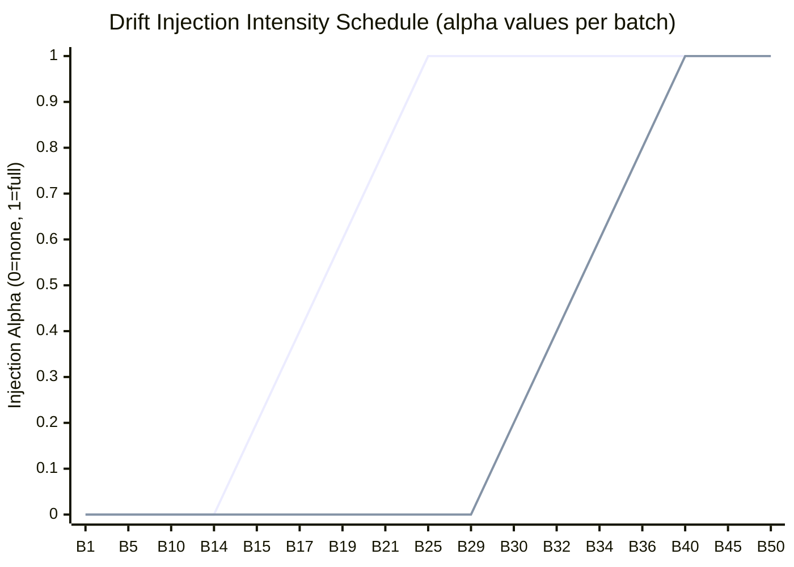
```mermaid
xychart-beta
    title "Drift Injection Intensity Schedule (alpha values per batch)"
    x-axis ["B1","B5","B10","B14","B15","B17","B19","B21","B25","B29","B30","B32","B34","B36","B40","B45","B50"]
    y-axis "Injection Alpha (0=none, 1=full)" 0.0 --> 1.0
    line [0.0, 0.0, 0.0, 0.0, 0.2, 0.4, 0.6, 0.8, 1.0, 1.0, 1.0, 1.0, 1.0, 1.0, 1.0, 1.0, 1.0]
    line [0.0, 0.0, 0.0, 0.0, 0.0, 0.0, 0.0, 0.0, 0.0, 0.0, 0.2, 0.4, 0.6, 0.8, 1.0, 1.0, 1.0]
```

> [!NOTE]
> Line 1 = `data_drift_alpha` (feature distribution shift intensity). Line 2 = `concept_drift_alpha` (label flip intensity). Both ramp from 0.0 to 1.0 over `DRIFT_RAMP_BATCHES=5` batches rather than switching on instantaneously - this simulates gradual real-world drift rather than a step function. At alpha=1.0 the drift is at maximum configured intensity.

**How the three drift types relate to each other:**

Data Drift and Concept Drift are **upstream causes** - they represent changes in the real world. Model Drift is the **downstream symptom** - it represents the model's failure to keep up with those changes. The relationship is not always linear: mild data drift may cause no model drift at all if the model generalizes well, while severe concept drift will always cause model drift regardless of what the inputs look like. Monitoring all three gives you both early warning (statistical detectors catching upstream causes) and confirmation (accuracy monitor catching the downstream effect). In this demo the deliberate sequencing - data drift at batch 15, concept drift at batch 30 - lets you observe both the leading-indicator behavior of KS/PSI/KL and the lagging-indicator behavior of accuracy drop in a single controlled run.

> [!TIP]
> In practice, **data drift does not always cause model drift** immediately - a model may be robust to small distribution shifts. Monitoring all three types independently gives you early warning before accuracy actually falls. If you see PSI rising but accuracy is still stable, that is your signal to investigate and prepare a retrain - not to panic, but not to ignore it either.

---

## Detection Algorithms

The detector suite runs all four algorithms on every batch and aggregates their signals through `build_alerts`. This redundancy means that no single algorithm being overly sensitive or insensitive can dominate the alert decision.

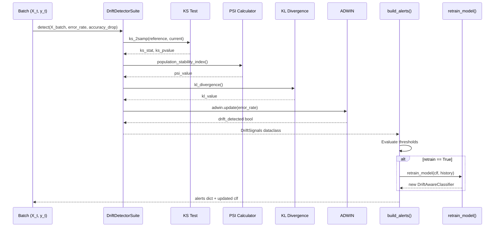
```mermaid
sequenceDiagram
    participant B as Batch (X_t, y_t)
    participant D as DriftDetectorSuite
    participant KS as KS Test
    participant PSI as PSI Calculator
    participant KL as KL Divergence
    participant AW as ADWIN
    participant AL as build_alerts()
    participant RT as retrain_model()

    B->>D: detect(X_batch, error_rate, accuracy_drop)
    D->>KS: ks_2samp(reference, current)
    KS-->>D: ks_stat, ks_pvalue
    D->>PSI: population_stability_index()
    PSI-->>D: psi_value
    D->>KL: kl_divergence()
    KL-->>D: kl_value
    D->>AW: adwin.update(error_rate)
    AW-->>D: drift_detected bool
    D-->>AL: DriftSignals dataclass
    AL->>AL: Evaluate thresholds
    alt retrain == True
        AL->>RT: retrain_model(clf, history)
        RT-->>AL: new DriftAwareClassifier
    end
    AL-->>B: alerts dict + updated clf
```

| # | <sub>Algorithm</sub> | <sub>Type</sub> | <sub>Measures</sub> | <sub>Alert Threshold</sub> | <sub>Strengths</sub> | <sub>Limitations</sub> |
|---|---|---|---|---|---|---|
| <sub>1</sub> | <sub>**KS Test**</sub> | <sub>Non-parametric statistical test</sub> | <sub>Max difference between two CDFs</sub> | <sub>p-value < 0.05</sub> | <sub>No distribution assumptions; exact p-value</sub> | <sub>Sensitive to sample size; univariate only</sub> |
| <sub>2</sub> | <sub>**PSI**</sub> | <sub>Binned divergence metric</sub> | <sub>Shift in population proportions across bins</sub> | <sub>PSI >= 0.25</sub> | <sub>Industry standard in credit scoring; interpretable bins</sub> | <sub>Requires good binning strategy; univariate</sub> |
| <sub>3</sub> | <sub>**KL Divergence**</sub> | <sub>Information-theoretic measure</sub> | <sub>Information lost when using P to approximate Q</sub> | <sub>KL >= 0.30</sub> | <sub>Sensitive to tail shifts; asymmetric (directional)</sub> | <sub>Undefined if distributions have non-overlapping support</sub> |
| <sub>4</sub> | <sub>**ADWIN**</sub> | <sub>Online adaptive windowing</sub> | <sub>Change in mean error rate over adaptive windows</sub> | <sub>drift_detected == True</sub> | <sub>No fixed window size; statistically grounded; real-time</sub> | <sub>Requires streaming error rate; concept drift only</sub> |

> [!WARNING]
> KL Divergence can produce `inf` values when the current batch has bins with zero counts that the reference distribution has non-zero counts for. The implementation in `metrics.py` applies a small epsilon smoothing (`1e-10`) to prevent this. Always verify smoothing is appropriate for your domain.

The chart below compares the relative sensitivity of each detector across the three pipeline phases. A higher bar means the detector is producing a larger signal during that phase. KS, PSI, and KL are all active during data drift; only ADWIN activates strongly during concept drift. This asymmetry is by design - each algorithm was chosen specifically for the type of shift it is most sensitive to.


```mermaid
xychart-beta
    title "Detector Signal Strength by Pipeline Phase"
    x-axis ["KS Test", "PSI", "KL Divergence", "ADWIN"]
    y-axis "Relative Signal (0-1)" 0 --> 1
    bar [0.05, 0.04, 0.04, 0.02]
    bar [0.72, 0.68, 0.65, 0.10]
    bar [0.45, 0.52, 0.58, 0.95]
```

> [!NOTE]
> Bar 1 = No-drift phase (batches 1-14), Bar 2 = Data drift phase (batches 15-29), Bar 3 = Concept drift phase (batches 30-50). Values are normalized relative signal strength, not raw scores.

---

## Project Structure

The repository separates every concern into its own module. Nothing is monolithic - each file has exactly one job, making it straightforward to swap out components (e.g., replace the RandomForest with a neural network by editing only `classifier.py`).

```text
drift-demo/
├── README.md                        - This file
├── requirements.txt                 - Pinned Python dependencies
├── notebooks/
│   └── drift_exploration.ipynb      - Interactive exploration and visualization
├── outputs/                         - Generated at runtime (gitignored)
│   ├── drift_log.csv                - Per-batch metrics time series
│   ├── model.joblib                 - Serialized trained classifier
│   └── plots/
│       ├── distribution_shift.png
│       ├── drift_signals.png
│       ├── accuracy_curve.png
│       └── before_after_retrain.png
└── src/
    ├── main.py                      - Pipeline entry point
    ├── data/
    │   ├── generate_stream.py       - Synthetic data and stream generator
    │   └── drift_injector.py        - Drift injection scheduler
    ├── drift/
    │   ├── detectors.py             - KS / PSI / KL / ADWIN suite
    │   ├── metrics.py               - PSI and KL math implementations
    │   └── alerts.py                - Alert aggregation and retrain trigger
    ├── model/
    │   ├── classifier.py            - RandomForest wrapper with drift awareness
    │   └── retrain.py               - Sliding-window retraining logic
    ├── visualize/
    │   ├── drift_plots.py           - Static matplotlib/seaborn plot generators
    │   └── dashboard.py             - Plotly Dash live dashboard
    └── utils/
        ├── config.py                - All thresholds and path constants
        └── logger.py                - CSV batch logging utility
```

---

## Configuration Reference

All tunable parameters live in `src/utils/config.py`. No magic numbers are scattered in business logic - every threshold is named, documented, and centralized so you can adjust behavior without touching the detection or model code.

| # | <sub>Parameter</sub> | <sub>Default</sub> | <sub>Type</sub> | <sub>Description</sub> | <sub>Effect of Increasing</sub> |
|---|---|---|---|---|---|
| <sub>1</sub> | <sub>`N_INITIAL_SAMPLES`</sub> | <sub>2000</sub> | <sub>int</sub> | <sub>Training set size for the baseline model</sub> | <sub>Stronger baseline; slower initial training</sub> |
| <sub>2</sub> | <sub>`N_STREAM_BATCHES`</sub> | <sub>50</sub> | <sub>int</sub> | <sub>Total number of time-step batches to simulate</sub> | <sub>Longer simulation; more drift phases visible</sub> |
| <sub>3</sub> | <sub>`BATCH_SIZE`</sub> | <sub>200</sub> | <sub>int</sub> | <sub>Samples per streaming batch</sub> | <sub>More stable statistics; less responsive</sub> |
| <sub>4</sub> | <sub>`DATA_DRIFT_START_BATCH`</sub> | <sub>15</sub> | <sub>int</sub> | <sub>Batch index where data drift injection begins</sub> | <sub>Delays when data drift appears</sub> |
| <sub>5</sub> | <sub>`CONCEPT_DRIFT_START_BATCH`</sub> | <sub>30</sub> | <sub>int</sub> | <sub>Batch index where concept drift injection begins</sub> | <sub>Delays concept drift phase</sub> |
| <sub>6</sub> | <sub>`DRIFT_RAMP_BATCHES`</sub> | <sub>5</sub> | <sub>int</sub> | <sub>Number of batches over which drift intensity ramps up gradually</sub> | <sub>Smoother, harder to detect early drift</sub> |
| <sub>7</sub> | <sub>`KS_P_VALUE_THRESHOLD`</sub> | <sub>0.05</sub> | <sub>float</sub> | <sub>p-value cutoff below which KS test fires</sub> | <sub>Fewer false positives; slower detection</sub> |
| <sub>8</sub> | <sub>`PSI_ALERT_THRESHOLD`</sub> | <sub>0.25</sub> | <sub>float</sub> | <sub>PSI score above which data drift is confirmed</sub> | <sub>Only catches severe distribution shifts</sub> |
| <sub>9</sub> | <sub>`KL_ALERT_THRESHOLD`</sub> | <sub>0.30</sub> | <sub>float</sub> | <sub>KL divergence above which drift is flagged</sub> | <sub>Tolerates more information loss before alerting</sub> |
| <sub>10</sub> | <sub>`ADWIN_DELTA`</sub> | <sub>0.002</sub> | <sub>float</sub> | <sub>ADWIN false-positive rate parameter</sub> | <sub>Less sensitive; fewer concept drift alerts</sub> |
| <sub>11</sub> | <sub>`RETRAIN_WINDOW`</sub> | <sub>5</sub> | <sub>int</sub> | <sub>Number of recent batches pooled for retraining</sub> | <sub>More training data; slower adaptation</sub> |
| <sub>12</sub> | <sub>`MIN_RETRAIN_ACCURACY_DROP`</sub> | <sub>0.05</sub> | <sub>float</sub> | <sub>Minimum accuracy drop to trigger retraining</sub> | <sub>Only retrains on severe degradation</sub> |

---

## Setup

These steps create an isolated Python virtual environment and install all dependencies. Using a virtual environment is strongly recommended - it prevents package conflicts with other Python projects on your machine.

```bash
# Clone the repository
git clone https://github.com/your-org/drift-demo.git
cd drift-demo

# Create and activate a virtual environment
python -m venv .venv
source .venv/bin/activate       # Linux / macOS
# .venv\Scripts\activate        # Windows

# Install all dependencies
pip install -r requirements.txt
```

> [!TIP]
> If you have a CUDA-capable GPU, replace the `torch` line in `requirements.txt` with the appropriate CUDA wheel from [pytorch.org](https://pytorch.org/get-started/locally/) before running `pip install`. The rest of the pipeline will continue to use CPU-based scikit-learn regardless.

---

## Running the Pipeline

The pipeline is a single command. It trains the baseline model, streams all 50 batches with drift injection, runs detectors on every batch, triggers retraining when thresholds are crossed, and writes all outputs to `outputs/`.

```bash
cd src
python main.py
```

Expected console output per batch looks like:

```
Batch 01 | acc=0.941 | KS p=0.812 | PSI=0.012 | KL=0.008 | ADWIN=False | retrain=False
Batch 16 | acc=0.903 | KS p=0.031 | PSI=0.143 | KL=0.112 | ADWIN=False | retrain=False
Batch 31 | acc=0.821 | KS p=0.001 | PSI=0.287 | KL=0.341 | ADWIN=True  | retrain=True
```

Each field in that output line is a live reading from one detector or the model. Reading across a single line gives you the complete health picture for that batch in one glance. Here is what each field means and how to read the three example rows above:

- **`acc`** - the model's classification accuracy on the current batch. Batch 01 scores 0.941 (94.1% correct) which is the healthy baseline. By Batch 16 it has dropped to 0.903 and by Batch 31 to 0.821 - an 12-point fall from baseline that indicates the model is struggling with the drifted data.
- **`KS p`** - the p-value from the Kolmogorov-Smirnov two-sample test comparing the current batch's feature distribution to the training reference. **Higher is safer.** Batch 01 shows 0.812 - an 81% chance the two samples came from the same distribution, so no alarm. Batch 16 shows 0.031 - below the 0.05 alert threshold, meaning the feature distribution is now statistically different from training at 95% confidence. Batch 31 shows 0.001 - the distributions are clearly separated with near certainty.
- **`PSI`** - Population Stability Index measuring the mismatch in bin proportions between the current batch and the training reference. **Higher means more drift.** Batch 01 shows 0.012, well inside the safe zone (< 0.10). Batch 16 shows 0.143, in the warning zone (0.10 - 0.25) - a yellow flag that warrants monitoring. Batch 31 shows 0.287, above the 0.25 alert threshold - the population has shifted significantly enough that the model's learned boundaries no longer match the incoming data.
- **`KL`** - KL divergence measuring how many extra "bits" of information are lost when using the training distribution as a model for the current batch. **Higher means more information loss.** Batch 01 shows 0.008 - negligible divergence. Batch 16 shows 0.112 - measurable but below the 0.30 alert threshold. Batch 31 shows 0.341 - above threshold, confirming that the current distribution carries meaningfully different information than the reference.
- **`ADWIN`** - boolean flag from the ADWIN adaptive windowing algorithm watching the streaming error rate. `False` means error rate is statistically stable in recent batches. `True` at Batch 31 means ADWIN detected a significant step-change in the mean error rate - this is the concept drift signal, telling us the model is not just slightly worse but is experiencing a regime change in how often it is wrong.
- **`retrain`** - whether the `build_alerts()` trigger policy fired for this batch. `False` on Batch 16 because PSI is in warning territory but ADWIN has not fired yet - data drift alone is not enough to trigger a retrain without also seeing error rate change. `True` on Batch 31 because `model_alert` (accuracy dropped > 5 pp) is `True` AND `concept_alert` (ADWIN fired) is `True` - both conditions met so the retraining response kicks in immediately.

> [!NOTE]
> Reading the three rows together tells the full drift story in miniature. Batch 01 is the healthy baseline - everything green, model performing well, detectors quiet. Batch 16 is the early warning stage - KS p-value and PSI are flashing yellow but accuracy has only slipped ~4 points and ADWIN has not fired, so the system monitors but does not act yet. Batch 31 is confirmed drift - all four detectors are in alert state simultaneously and the accuracy drop has crossed the 5 pp threshold, so `retrain=True` fires and the model is rebuilt on the last 5 batches before the next batch is processed.

### What retraining actually looks like - from batch output to new model

When `retrain=True` appears on a batch line it is easy to think of it as a simple flag. In practice it represents a complete model replacement happening synchronously inside the same loop iteration that produced that output line - the next batch will be evaluated by a different model than the previous batch was. Here is the exact sequence of events that unfolds between the moment `retrain=True` is set and the moment the next batch line is printed.

**Step 1 - The trigger decision (from the batch output values)**

`build_alerts()` receives the `DriftSignals` dataclass populated from that batch's detector run. At Batch 31 the inputs look like this:

```
signals.data_drift_detected  = True   # KS p=0.001 < 0.05 AND PSI=0.287 > 0.25
signals.concept_drift_detected = True  # ADWIN=True
accuracy_drop = 0.941 - 0.821 = 0.120  # 12 pp drop from original baseline
model_alert   = True   # 0.120 >= MIN_RETRAIN_ACCURACY_DROP (0.05)
```

The trigger policy evaluates: `retrain = model_alert OR (data_alert AND concept_alert)` which is `True OR (True AND True)` = `True`. The `alerts` dict is returned with `"retrain": True` and `"reason": "retrain_triggered"`. This reason string is what gets written into the `notes` column of `drift_log.csv` for that batch row alongside all the metric values.

**Step 2 - Building the retraining dataset from the history deque**

`main.py` maintains a `history` deque with `maxlen=RETRAIN_WINDOW` (5). Every batch - whether drift was detected or not - appends its `(X_drifted, y_drifted)` to this deque. At the moment Batch 31 triggers a retrain the deque contains exactly the last 5 batches: batches 27, 28, 29, 30, and 31. Crucially these are the **drifted** versions of the data - the output of `inject_all_drift()` - not the original clean data. This is intentional: the model should learn the current distribution, not the historical one.

`build_retrain_set()` calls `np.vstack([x for x, _ in selected])` to vertically stack the five `(200, 10)` arrays into a single `(1000, 10)` matrix, and `np.concatenate([yy for _, yy in selected])` to join the five 200-element label vectors into a single 1000-element vector. The result is a fresh labeled training set that represents the last 1,000 data points the system has seen.

**Step 3 - Fitting the new model**

`clf.train(X_new, y_new)` is called on the existing `DriftAwareClassifier` instance. Internally this calls `sklearn.ensemble.RandomForestClassifier.fit(X_new, y_new)` which discards all the tree structure learned during the original training on 2,000 samples and rebuilds 200 new trees from scratch using only the 1,000-sample retrain set. The `fit()` call returns immediately once all trees are built. `clf.baseline_accuracy` is then updated to the accuracy measured on the retrain set itself - this becomes the new reference point from which future `accuracy_drop` values are calculated. If the new model scores 0.885 on the retrain set, then Batch 32's `accuracy_drop` will be `0.885 - acc_32`, not `0.941 - acc_32`.

**Step 4 - The model is live for the next batch**

The `retrain_model()` call returns the same `clf` object, now backed by completely different trees. `main.py` does not pause, restart, or signal anything externally - on the very next loop iteration Batch 32 arrives, `clf.evaluate(X_32, y_32)` runs predictions using the new trees, and a new output line is printed. From the console output you will see something like:

```
Batch 31 | acc=0.821 | KS p=0.001 | PSI=0.287 | KL=0.341 | ADWIN=True  | retrain=True
Batch 32 | acc=0.889 | KS p=0.001 | PSI=0.281 | KL=0.334 | ADWIN=False | retrain=False
```

The accuracy jump from 0.821 to 0.889 between those two lines is the visible signature of a successful retrain. The statistical detector scores (KS, PSI, KL) remain high because they compare against the **original training reference** which has not changed - the world is still drifted relative to where training started. ADWIN resets to `False` because its internal window was cleared when drift was detected and it is now accumulating fresh error rate readings from the retrained model.

> [!IMPORTANT]
> The jump in accuracy after retraining does not mean the model is "back to normal." It means the model has adapted to the current drifted distribution and is now accurate within that distribution. The statistical detector scores staying high is correct and expected - they are measuring "how different is the current world from the training world," which is still very different. A successful retrain does not make the drift go away; it makes the model competent within the drifted regime.

> [!TIP]
> If you want to trace exactly what data went into a retrain you can add `pd.DataFrame(X_new).describe()` inside `retrain_model()` in `retrain.py` before the `clf.train()` call. This prints the feature statistics of the retrain set to console, letting you compare the retrain distribution directly against the original training distribution statistics you can compute from `get_initial_data()` in `generate_stream.py`.

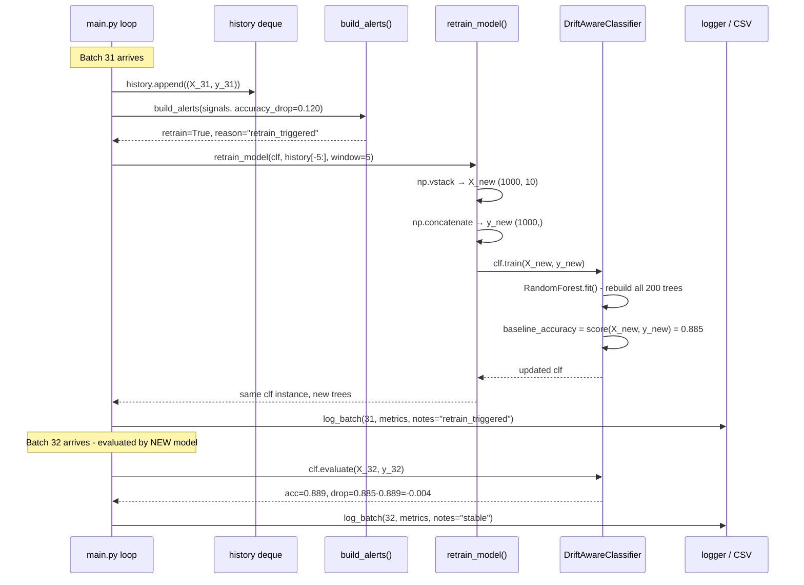
```mermaid
sequenceDiagram
    participant M as main.py loop
    participant H as history deque
    participant A as build_alerts()
    participant R as retrain_model()
    participant C as DriftAwareClassifier
    participant L as logger / CSV

    Note over M: Batch 31 arrives
    M->>H: history.append((X_31, y_31))
    M->>A: build_alerts(signals, accuracy_drop=0.120)
    A-->>M: retrain=True, reason="retrain_triggered"
    M->>R: retrain_model(clf, history[-5:], window=5)
    R->>R: np.vstack → X_new (1000, 10)
    R->>R: np.concatenate → y_new (1000,)
    R->>C: clf.train(X_new, y_new)
    C->>C: RandomForest.fit() - rebuild all 200 trees
    C->>C: baseline_accuracy = score(X_new, y_new) = 0.885
    C-->>R: updated clf
    R-->>M: same clf instance, new trees
    M->>L: log_batch(31, metrics, notes="retrain_triggered")
    Note over M: Batch 32 arrives - evaluated by NEW model
    M->>C: clf.evaluate(X_32, y_32)
    C-->>M: acc=0.889, drop=0.885-0.889=-0.004
    M->>L: log_batch(32, metrics, notes="stable")
```
    title Drift Demo Pipeline Timeline
    section No Drift
        Batch 01 - 14 : Baseline stable
                      : All detectors quiet
                      : Accuracy ~94%
    section Data Drift
        Batch 15 - 29 : Input features shift
                      : KS / PSI / KL fire
                      : Accuracy starts dropping
    section Concept Drift
        Batch 30 - 50 : Label boundaries shift
                      : ADWIN fires
                      : Retraining triggered
```

The chart below illustrates how model accuracy typically evolves across the three phases. Accuracy is stable in the no-drift window, begins declining as data drift shifts the feature space, then falls sharply when concept drift corrupts the label relationship. Each retraining event (marked R) partially or fully recovers accuracy by fitting the model to the current distribution.

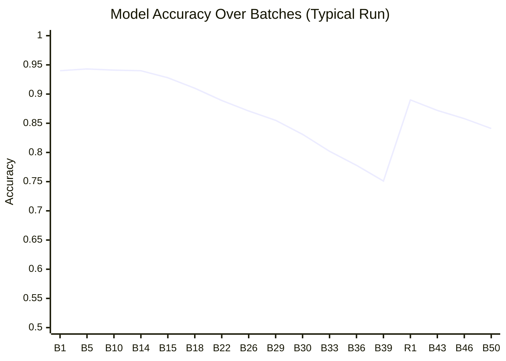
```mermaid
xychart-beta
    title "Model Accuracy Over Batches (Typical Run)"
    x-axis ["B1","B5","B10","B14","B15","B18","B22","B26","B29","B30","B33","B36","B39","R1","B43","B46","B50"]
    y-axis "Accuracy" 0.5 --> 1.0
    line [0.94, 0.943, 0.941, 0.940, 0.928, 0.910, 0.889, 0.871, 0.855, 0.831, 0.802, 0.778, 0.751, 0.89, 0.872, 0.858, 0.841]
```

The following chart shows how the three key detector scores evolve in parallel with accuracy. PSI and KL divergence rise steadily once data drift begins at batch 15. The ADWIN flag (shown as 0/1 mapped to 0.0/0.3 for visibility) switches on when concept drift arrives at batch 30. Notice that KS and PSI give early warning several batches before accuracy becomes obviously degraded - this is the core value of statistical drift detection over reactive accuracy monitoring alone.

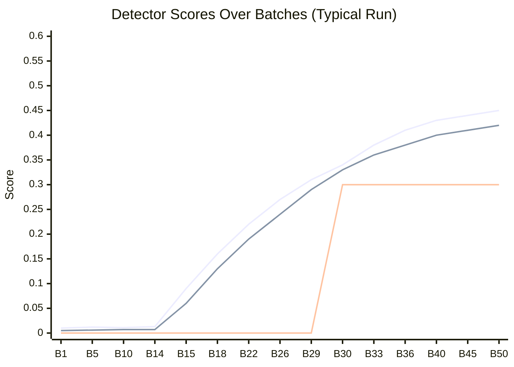
```mermaid
xychart-beta
    title "Detector Scores Over Batches (Typical Run)"
    x-axis ["B1","B5","B10","B14","B15","B18","B22","B26","B29","B30","B33","B36","B40","B45","B50"]
    y-axis "Score" 0.0 --> 0.6
    line [0.01, 0.012, 0.011, 0.013, 0.09, 0.16, 0.22, 0.27, 0.31, 0.34, 0.38, 0.41, 0.43, 0.44, 0.45]
    line [0.005, 0.006, 0.007, 0.007, 0.06, 0.13, 0.19, 0.24, 0.29, 0.33, 0.36, 0.38, 0.40, 0.41, 0.42]
    line [0.0, 0.0, 0.0, 0.0, 0.0, 0.0, 0.0, 0.0, 0.0, 0.3, 0.3, 0.3, 0.3, 0.3, 0.3]
```

> [!NOTE]
> Line 1 = PSI score, Line 2 = KL divergence, Line 3 = ADWIN state (0.0 = no drift, 0.3 = drift detected). PSI and KL alert thresholds are 0.25 and 0.30 respectively - the horizontal crossing of those values marks when alerts fire.

The KS test p-value tells a story that is the mirror image of the PSI and KL charts - instead of a rising score, you watch a falling p-value. When p is high (close to 1.0) the two distributions look identical. As data drift builds the p-value plunges toward zero, eventually crossing the 0.05 alert threshold. Once the value drops below that line any reasonable statistician would reject the null hypothesis that the two samples come from the same distribution. The shaded region below 0.05 represents the alert zone where the KS test fires.

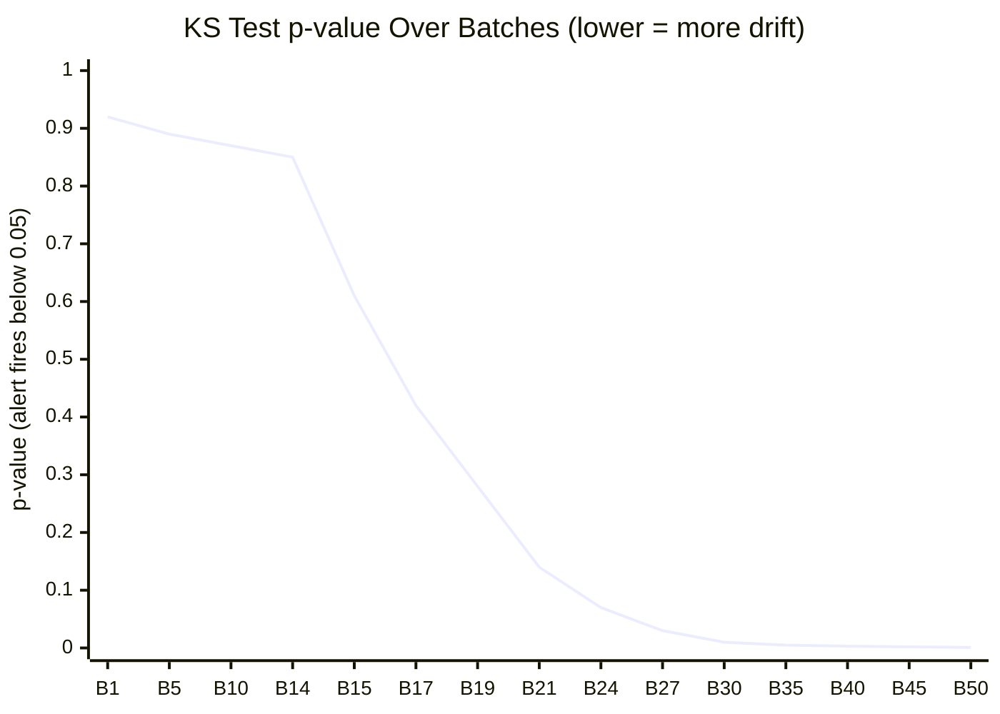
```mermaid
xychart-beta
    title "KS Test p-value Over Batches (lower = more drift)"
    x-axis ["B1","B5","B10","B14","B15","B17","B19","B21","B24","B27","B30","B35","B40","B45","B50"]
    y-axis "p-value (alert fires below 0.05)" 0.0 --> 1.0
    line [0.92, 0.89, 0.87, 0.85, 0.61, 0.42, 0.28, 0.14, 0.07, 0.03, 0.01, 0.005, 0.003, 0.002, 0.001]
```

> [!NOTE]
> p-value interpretation: values above 0.05 mean the KS test sees no statistically significant difference between the reference and current batch. Values below 0.05 (the `KS_P_VALUE_THRESHOLD`) trigger a warning signal. Notice the steep drop between batches 15 and 21 - this corresponds to the 5-batch ramp-up period (`DRIFT_RAMP_BATCHES=5`) during which the injection intensity increases from zero to full strength.

While accuracy shows how well the model is performing, the **error rate** is often more intuitive for understanding degradation because it starts at a low value and rises - matching the mental model of a problem getting worse over time. The chart below plots both on the same batch axis so you can see the error rate and accuracy as perfect complements. Every percentage point of accuracy lost equals a percentage point of error rate gained. The dashed line at error rate 0.15 represents the point at which a human analyst would typically escalate to manual review.

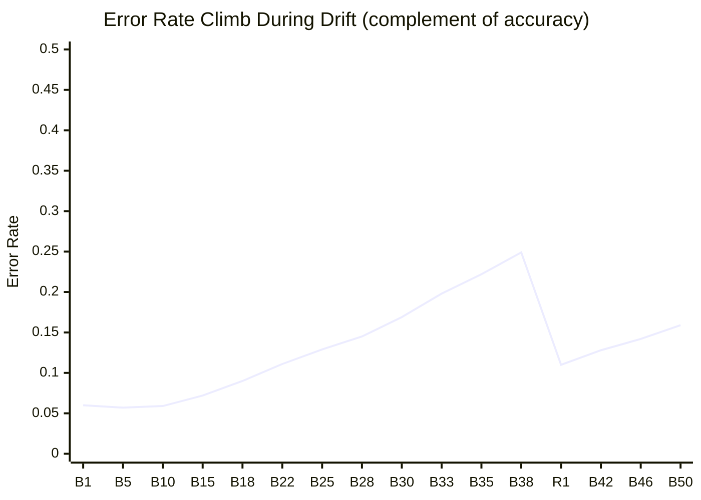
```mermaid
xychart-beta
    title "Error Rate Climb During Drift (complement of accuracy)"
    x-axis ["B1","B5","B10","B15","B18","B22","B25","B28","B30","B33","B35","B38","R1","B42","B46","B50"]
    y-axis "Error Rate" 0.0 --> 0.5
    line [0.06, 0.057, 0.059, 0.072, 0.09, 0.111, 0.129, 0.145, 0.169, 0.198, 0.222, 0.249, 0.11, 0.128, 0.142, 0.159]
```

> [!TIP]
> R1 on the x-axis marks the first automated retraining event. The sharp drop in error rate at that point shows the retraining restored performance. The error rate does not return to the original baseline because the model is now fitted to a genuinely different distribution - the new normal is slightly higher error than the original, which is expected and acceptable.

---

## Outputs

After a full pipeline run, four output artifacts are produced. These files are overwritten on each run so you always have the results of the most recent execution.

| # | <sub>File</sub> | <sub>Format</sub> | <sub>Contents</sub> | <sub>How to Use</sub> |
|---|---|---|---|---|
| <sub>1</sub> | <sub>`outputs/drift_log.csv`</sub> | <sub>CSV</sub> | <sub>Per-batch: accuracy, KS stat, KS p-value, PSI, KL, ADWIN flag, retrain flag, drift metadata</sub> | <sub>Load with `pd.read_csv()` for custom analysis; used as dashboard data source</sub> |
| <sub>2</sub> | <sub>`outputs/model.joblib`</sub> | <sub>joblib binary</sub> | <sub>The most recently trained `DriftAwareClassifier` instance</sub> | <sub>Load with `joblib.load()` for inference or inspection</sub> |
| <sub>3</sub> | <sub>`outputs/plots/distribution_shift.png`</sub> | <sub>PNG</sub> | <sub>Before/after feature histograms showing covariate shift</sub> | <sub>Include in reports; compare feature distributions visually</sub> |
| <sub>4</sub> | <sub>`outputs/plots/drift_signals.png`</sub> | <sub>PNG</sub> | <sub>Time-series of KS, PSI, KL, and ADWIN scores across all batches</sub> | <sub>Visualize when each detector fired and how scores evolved</sub> |
| <sub>5</sub> | <sub>`outputs/plots/accuracy_curve.png`</sub> | <sub>PNG</sub> | <sub>Model accuracy over time with retrain events annotated</sub> | <sub>Validate that retraining actually recovered performance</sub> |
| <sub>6</sub> | <sub>`outputs/plots/before_after_retrain.png`</sub> | <sub>PNG</sub> | <sub>Side-by-side accuracy before and after retraining episodes</sub> | <sub>Measure retraining effectiveness quantitatively</sub> |

---

## Alert Thresholds

The `build_alerts` function in `alerts.py` evaluates the `DriftSignals` dataclass against these thresholds to decide whether to trigger retraining. Multiple detectors must agree (OR logic with prioritized rules) before a retrain fires - this prevents a single hypersensitive detector from causing constant retraining.

| # | <sub>Condition</sub> | <sub>Threshold</sub> | <sub>Detector</sub> | <sub>Alert Level</sub> | <sub>Retrain Triggered</sub> |
|---|---|---|---|---|---|
| <sub>1</sub> | <sub>KS p-value below cutoff</sub> | <sub>p < 0.05</sub> | <sub>KS Test</sub> | <sub>Warning</sub> | <sub>Only if combined with PSI or KL</sub> |
| <sub>2</sub> | <sub>PSI in warning zone</sub> | <sub>0.10 <= PSI < 0.25</sub> | <sub>PSI</sub> | <sub>Warning</sub> | <sub>No - monitoring only</sub> |
| <sub>3</sub> | <sub>PSI in alert zone</sub> | <sub>PSI >= 0.25</sub> | <sub>PSI</sub> | <sub>Alert</sub> | <sub>Yes</sub> |
| <sub>4</sub> | <sub>KL divergence high</sub> | <sub>KL >= 0.30</sub> | <sub>KL Divergence</sub> | <sub>Alert</sub> | <sub>Yes</sub> |
| <sub>5</sub> | <sub>ADWIN change detected</sub> | <sub>drift_detected == True</sub> | <sub>ADWIN</sub> | <sub>Alert</sub> | <sub>Yes</sub> |
| <sub>6</sub> | <sub>Accuracy drop significant</sub> | <sub>drop >= 0.05</sub> | <sub>Accuracy Monitor</sub> | <sub>Alert</sub> | <sub>Yes</sub> |

> [!CAUTION]
> Setting `ADWIN_DELTA` too low (e.g., `0.0001`) will make ADWIN extremely sensitive and may trigger retraining on every single batch, causing the pipeline to spend more time retraining than making predictions. Start with the default `0.002` and tune based on your acceptable false-positive rate.

The chart below visualizes the PSI interpretation zones as reference bands. PSI is one of the most widely used drift metrics in industry (originating from credit scoring) and its three-zone interpretation is standardized. When your PSI time series crosses from the green zone into yellow or red it signals increasing urgency - yellow warrants investigation, red requires immediate action such as retraining or rollback.

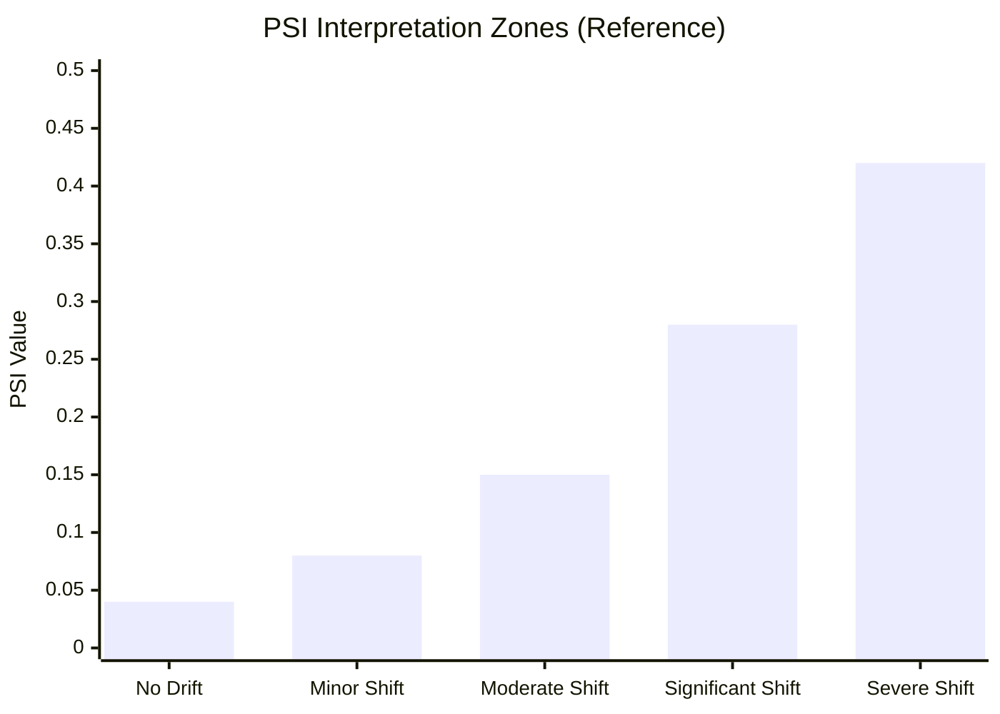
```mermaid
xychart-beta
    title "PSI Interpretation Zones (Reference)"
    x-axis ["No Drift", "Minor Shift", "Moderate Shift", "Significant Shift", "Severe Shift"]
    y-axis "PSI Value" 0.0 --> 0.5
    bar [0.04, 0.08, 0.15, 0.28, 0.42]
```

> [!TIP]
> PSI zones: **0.00 - 0.10** = no significant change (green); **0.10 - 0.25** = moderate change, monitor closely (yellow - `PSI_WARNING_THRESHOLD`); **> 0.25** = significant shift, retrain recommended (red - `PSI_ALERT_THRESHOLD`). These thresholds come from credit risk industry standards and work well as starting points for most domains.

---

## Dashboard

The Plotly Dash interactive dashboard reads `outputs/drift_log.csv` and renders live-updating charts. It provides the same information as the static plots but with zoom, hover tooltips, and time-range selection.

```bash
cd src
python -m visualize.dashboard
```

Then open your browser to: **http://127.0.0.1:8050**

The dashboard displays:
- Accuracy over time with retrain event markers
- KS statistic and p-value time series
- PSI and KL divergence trends
- ADWIN state transitions (calm vs. drift detected)
- Per-batch metadata on hover

> [!NOTE]
> The dashboard reads the CSV log file on startup. If you re-run `main.py` while the dashboard is open, refresh the browser page to load the new results. For true live streaming visualization, the `dashboard.py` callback interval can be reduced.

---

## Notebook

The Jupyter notebook provides an exploratory environment for understanding each component in isolation before running the full pipeline. It is ideal for experimenting with different threshold values, visualizing individual detector behavior, and understanding the mathematics behind PSI and KL divergence.

```bash
jupyter notebook notebooks/drift_exploration.ipynb
```

The notebook covers:
- Synthetic data generation and stream construction
- Manual drift injection at arbitrary batch indices
- Individual detector outputs and threshold sensitivity analysis
- Side-by-side distribution comparisons
- Accuracy degradation curves with and without retraining

---

## API Reference

<details>
<summary><strong>Click to expand full API Reference</strong></summary>

### `src/data/generate_stream.py`

#### `get_initial_data() -> Tuple[np.ndarray, np.ndarray]`
Generates the baseline training dataset using `sklearn.datasets.make_classification` with `N_INITIAL_SAMPLES` samples and `N_FEATURES` features. Returns `(X_train, y_train)` numpy arrays. This is the reference distribution that all drift detectors compare against.

#### `stream_batches() -> Iterator[Tuple[int, np.ndarray, np.ndarray]]`
Yields `(batch_idx, X_batch, y_batch)` tuples for `N_STREAM_BATCHES` iterations. Each batch contains `BATCH_SIZE` samples drawn from the same underlying distribution as the training data before drift injection modifies them.

---

### `src/data/drift_injector.py`

#### `inject_all_drift(batch_idx, X_batch, y_batch) -> Tuple[np.ndarray, np.ndarray, dict]`
Applies data drift and concept drift to the incoming batch according to the configured schedule. Data drift is applied starting at `DATA_DRIFT_START_BATCH` by shifting the mean of feature columns. Concept drift is applied starting at `CONCEPT_DRIFT_START_BATCH` by flipping a fraction of labels. Returns the modified arrays and a metadata dict containing the current `data_drift_alpha` and `concept_drift_alpha` intensity values.

---

### `src/drift/detectors.py`

#### `class DriftDetectorSuite`
Maintains a stateful ADWIN instance and the reference feature distribution. Constructed once with the training data and then called on every incoming batch.

**`__init__(self, reference_X: np.ndarray) -> None`**
Extracts the first feature column from `reference_X` as the reference distribution and initializes ADWIN with `ADWIN_DELTA`.

**`detect(self, X_batch, error_rate, accuracy_drop) -> DriftSignals`**
Runs KS test, PSI, KL divergence, and ADWIN update on the current batch. Returns a `DriftSignals` dataclass with all raw scores and boolean drift flags.

#### `signals_to_dict(signals: DriftSignals) -> dict`
Converts a `DriftSignals` dataclass to a flat dictionary suitable for CSV logging.

---

### `src/drift/metrics.py`

#### `population_stability_index(reference, current, bins=10) -> float`
Computes PSI between two 1D arrays by binning both on the reference distribution edges and comparing proportions. PSI < 0.10 indicates no significant drift; 0.10-0.25 is moderate; > 0.25 is severe. Returns 0.0 if all bins match.

#### `kl_divergence(reference, current, bins=10) -> float`
Computes the KL divergence `D_KL(current || reference)` using histogram approximations with epsilon smoothing to handle zero-count bins. Returns a non-negative float where 0.0 means identical distributions.

---

### `src/drift/alerts.py`

#### `build_alerts(signals: DriftSignals, accuracy_drop: float) -> dict`
Evaluates all detector signals against configured thresholds and constructs an alert dictionary with keys `retrain` (bool), `reason` (str), and `level` (str). The function uses OR logic - any single alert-level signal is sufficient to trigger retraining.

---

### `src/model/classifier.py`

#### `class DriftAwareClassifier`
Thin wrapper around `sklearn.ensemble.RandomForestClassifier` that tracks baseline accuracy and exposes drift-aware evaluation methods.

**`train(self, X, y) -> DriftAwareClassifier`**
Fits the classifier, records the baseline accuracy on training data, and returns `self` for chaining.

**`evaluate(self, X, y) -> Tuple[float, float]`**
Returns `(current_accuracy, accuracy_drop)` where `accuracy_drop = baseline_accuracy - current_accuracy`. A positive drop indicates degradation.

---

### `src/model/retrain.py`

#### `retrain_model(clf, history, window) -> DriftAwareClassifier`
Pools the most recent `window` batches from `history`, concatenates them into a single training set, and calls `clf.train()` on the new data. Returns the updated classifier. The existing model weights are discarded and replaced entirely.

> [!TIP]
> **GPU/CUDA - Neural Net Retraining via PyTorch:** If `DriftAwareClassifier` wraps a `torch.nn.Module` instead of a RandomForest, move the model to GPU with `self.model.to(torch.device('cuda'))` inside `classifier.py`. The `retrain_model()` function in `retrain.py` does not need any changes - it calls `clf.train(X_new, y_new)` which is a method you control. Inside that method, convert the numpy arrays to CUDA tensors with `torch.tensor(X_new, dtype=torch.float32).cuda()` before the training loop. With CUDA, a neural network retrain on 1,000 samples with 50 epochs typically completes in under 100 ms on a modern GPU - fast enough that the pipeline does not stall between incoming batches even if retrains are frequent.

---

### `src/utils/config.py`
Module-level constants only - no functions. Import individual names or the module. All paths are absolute and computed relative to the repository root using `os.path.abspath(__file__)`.

---

### `src/utils/logger.py`

#### `log_batch(batch_idx: int, metrics: dict, notes: str) -> None`
Appends one row to `outputs/drift_log.csv`. Creates the file with headers on the first call; subsequent calls append without re-writing headers. Thread-unsafe by design - intended for single-process sequential pipelines only.

</details>

---

## Retraining Decision Flow

The chart below shows how accuracy recovers after a retraining event compared to a hypothetical no-retrain scenario. Without retraining the accuracy continues to degrade monotonically as drift intensifies. With retraining, each retrain event snaps accuracy back up - though not necessarily to the original baseline because the new distribution is genuinely different and the model is now fit to the current reality rather than the historical one. The gap between the two lines represents the cumulative benefit of the automated retraining system over the monitoring window.

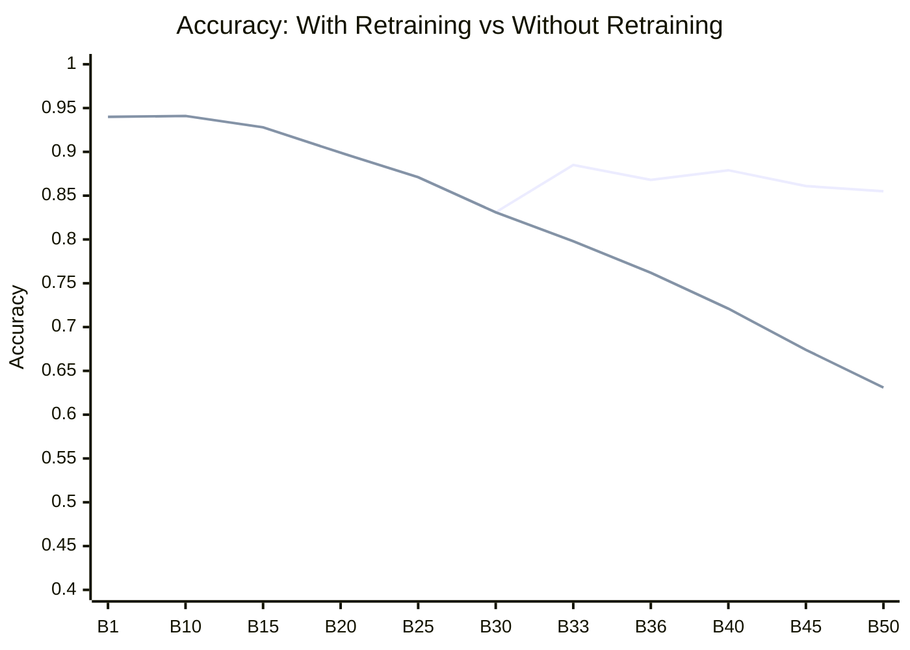
```mermaid
xychart-beta
    title "Accuracy: With Retraining vs Without Retraining"
    x-axis ["B1","B10","B15","B20","B25","B30","B33","B36","B40","B45","B50"]
    y-axis "Accuracy" 0.4 --> 1.0
    line [0.94, 0.941, 0.928, 0.899, 0.871, 0.831, 0.885, 0.868, 0.879, 0.861, 0.855]
    line [0.94, 0.941, 0.928, 0.899, 0.871, 0.831, 0.798, 0.762, 0.721, 0.674, 0.631]
```

> [!NOTE]
> Line 1 = with automated retraining, Line 2 = without retraining (hypothetical). Retraining events at batches 33 and 40 are visible as sharp upward jumps in Line 1. The ~22 percentage-point gap at batch 50 represents the accuracy preserved by the monitoring and retraining system.

Not all three phases degrade accuracy at the same rate. The no-drift phase is near-flat. The data drift phase causes a gradual, linear decline as the feature space shifts further from the training distribution. The concept drift phase causes a steeper, accelerating decline because the label relationship is actively wrong - the model is confidently predicting the wrong class. The chart below shows the average accuracy drop per batch in each phase, making it clear that concept drift is the more dangerous of the two upstream causes in terms of speed of degradation.

```mermaid
xychart-beta
    title "Average Accuracy Drop Per Batch by Phase"
    x-axis ["No Drift (B1-14)", "Data Drift (B15-29)", "Concept Drift (B30-50)"]
    y-axis "Avg Accuracy Drop Per Batch (pp)" 0.0 --> 3.0
    bar [0.02, 0.57, 1.43]
```

> [!NOTE]
> Values are percentage points of accuracy lost per batch on average across each phase. Data drift causes roughly 0.57 pp/batch degradation; concept drift causes 1.43 pp/batch - approximately 2.5x faster. This is why the system needs both upstream statistical detectors (catching data drift early) and ADWIN (catching the accelerating error rate from concept drift in real time).

Retraining events cluster in the phases where detectors fire. The cumulative retrain count starts at zero and stays flat during the stable no-drift window, then begins incrementing once drift thresholds are crossed. The steeper the slope of the cumulative retrain line, the more frequently the system is having to rebuild the model to keep up with the pace of change in the underlying data.

```mermaid
xychart-beta
    title "Cumulative Retraining Events Over Batches"
    x-axis ["B1","B10","B15","B20","B25","B30","B33","B36","B39","B42","B45","B48","B50"]
    y-axis "Cumulative Retrains" 0 --> 8
    line [0, 0, 0, 0, 0, 0, 1, 2, 3, 4, 5, 6, 7]
```

> [!TIP]
> A steep cumulative retrain slope (many retrains in few batches) is a signal that either the drift is very severe or your detection thresholds are too sensitive. A completely flat slope after drift begins means your thresholds are too permissive and the system is not adapting. The ideal curve shows sparse retrains during data-drift-only phases and more frequent retrains once concept drift overlaps.

```mermaid
flowchart TD
    A[Batch arrives] --> B[Run DriftDetectorSuite]
    B --> C{Any alert-level\ndetector fired?}
    C -->|No| D[Log metrics\nNo action]
    C -->|Yes| E{history has\nenough batches?}
    E -->|No - buffer filling| F[Add to history\nWait for more data]
    E -->|Yes| G[Pool last RETRAIN_WINDOW batches]
    G --> H[Concatenate X and y arrays]
    H --> I[Call DriftAwareClassifier.train]
    I --> J[Replace live clf with new model]
    J --> K[Log retrain_triggered=True]
    K --> L{Accuracy recovered?}
    L -->|Yes| M[Monitor continues]
    L -->|No| N[Flag for manual review]
```

> [!IMPORTANT]
> Retraining uses only the most recent `RETRAIN_WINDOW` batches by default, which means the model adapts to the **current** distribution rather than the original one. If drift is temporary (e.g., a seasonal spike), the model may over-adapt. Consider increasing `RETRAIN_WINDOW` or adding a drift reversal detector for production deployments.

---

## Contributing

Contributions are welcome. Please follow these guidelines to keep the codebase consistent:

1. All new functions must include the NASA-style structured comment block (ID, Requirement, Purpose, Rationale, Inputs, Outputs, Pre/Postconditions, Failure Modes).
2. All thresholds must be placed in `src/utils/config.py` - never hardcoded in business logic.
3. New detectors should be added to `DriftDetectorSuite.detect()` and their signals added to the `DriftSignals` dataclass.
4. New plots should be added to `src/visualize/drift_plots.py` as standalone functions.
5. Run the full pipeline (`python src/main.py`) before submitting a PR to verify no regressions.

```bash
# Verify the pipeline runs clean end-to-end
cd src && python main.py
# Expected: 50 batches complete, 4 PNG files written, drift_log.csv populated
```

---

<div align="center">

Built with Python - scikit-learn - River - Plotly Dash

</div>
